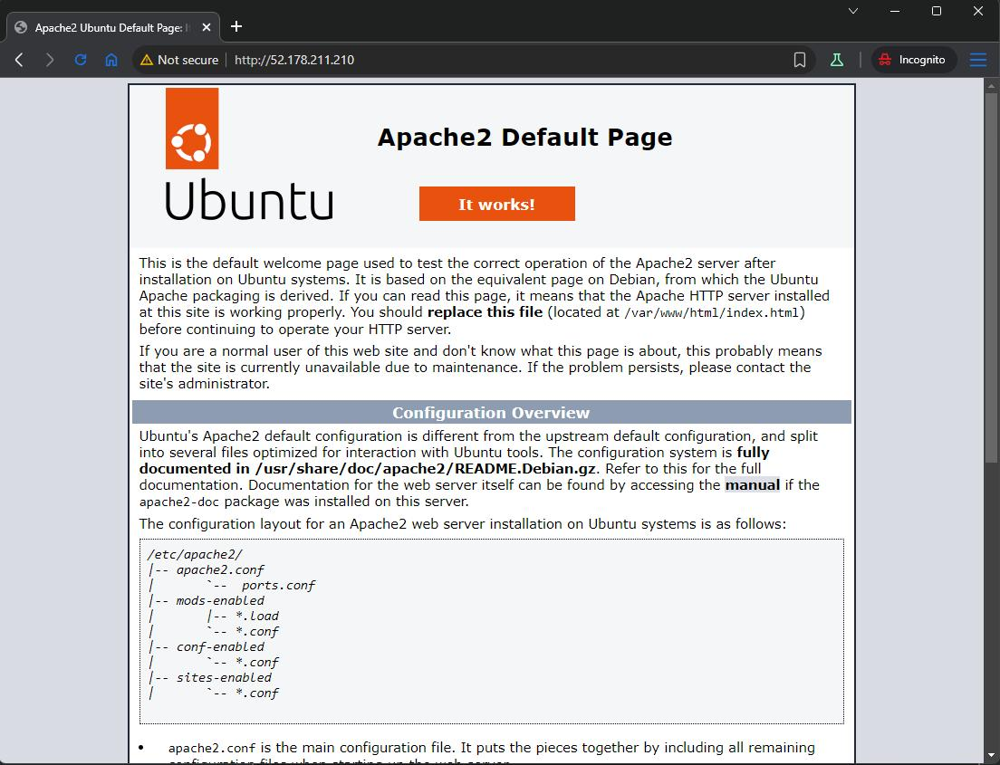

### Create an Ubuntu Server 20.04 (or 22.04, or 24.04) based virtual machine using the B1s size or similar

1. Login Azure CLI

```sh
az login
```

2. Check Azure subscription

```sh
az account subscription list
```

3. Create Azure Resource Group

```sh
az group create --name homework-m1-rg --location northeurope

# Output
{
  "id": "/subscriptions/ede4771c-fc75-42d7-9d7f-e2250e8cf5d4/resourceGroups/homework-m1-rg",
  "location": "northeurope",
  "managedBy": null,
  "name": "homework-m1-rg",
  "properties": {
    "provisioningState": "Succeeded"
  },
  "tags": null,
  "type": "Microsoft.Resources/resourceGroups"
}
```

5. Create virtual machine

```sh
az vm create \
--resource-group homework-m1-rg \
--name homework-m1-vm \
--image Ubuntu2404 \
--size Standard_B1s \
--public-ip-sku Standard \
--admin-username azure-admin \
--generate-ssh-keys \
--location northeurope

# Output
{
  "fqdns": "",
  "id": "/subscriptions/ede4771c-fc75-42d7-9d7f-e2250e8cf5d4/resourceGroups/homework-m1-rg/providers/Microsoft.Compute/virtualMachines/homework-m1-vm",
  "location": "northeurope",
  "macAddress": "00-22-48-9D-D9-32",
  "powerState": "VM running",
  "privateIpAddress": "10.0.0.4",
  "publicIpAddress": "52.178.211.210",
  "resourceGroup": "homework-m1-rg"
}
```

### Add a second hard disk with 20 GB in size, format it with a file system (i.e. EXT4) and mount it

1. Attach a new disk to the VM

```sh
az vm disk attach \
-g homework-m1-rg \
--vm-name homework-m1-vm \
--name data-disk \
--new \
--size-gb 20
```

2. Check new disk

```sh
az vm show \
-g homework-m1-rg \
--vm-name homework-m1-vm \
--query "storageProfile.dataDisks"

# Output (list of drives)
[
  {
    "caching": "None",
    "createOption": "Empty",
    "deleteOption": "Detach",
    "detachOption": null,
    "diskIopsReadWrite": null,
    "diskMBpsReadWrite": null,
    "diskSizeGb": 20,
    "image": null,
    "lun": 0,
    "managedDisk": {
      "diskEncryptionSet": null,
      "id": "/subscriptions/ede4771c-fc75-42d7-9d7f-e2250e8cf5d4/resourceGroups/homework-m1-rg/providers/Microsoft.Compute/disks/data-disk",
      "resourceGroup": "homework-m1-rg",
      "securityProfile": null,
      "storageAccountType": "Premium_LRS"
    },
    "name": "data-disk",
    "sourceResource": null,
    "toBeDetached": false,
    "vhd": null,
    "writeAcceleratorEnabled": null
  }
]
```

3. Create `format-and-mount.json` file to with shell command to format drive and mount.

```json
{
  "commandToExecute": "parted /dev/sdc --script mklabel gpt mkpart primary ext4 0% 100% && mkfs.ext4 /dev/sdc1 && mkdir -p /mnt/data && mount /dev/sdc1 /mnt/data && echo '/dev/sdc1 /mnt/data ext4 defaults,nofail 0 2' >> /etc/fstab"
}
```

3. Execute custom script to format and mount the disk.

- `nofail 0 2` - recommended for Azure data disks

```sh
az vm extension set \
--resource-group homework-m1-rg \
--vm-name homework-m1-vm \
--publisher Microsoft.Azure.Extensions \
--name CustomScript \
--settings @format-and-mount.json

# Output
{
  "autoUpgradeMinorVersion": true,
  "id": "/subscriptions/ede4771c-fc75-42d7-9d7f-e2250e8cf5d4/resourceGroups/homework-m1-rg/providers/Microsoft.Compute/virtualMachines/homework-m1-vm/extensions/CustomScript",
  "location": "northeurope",
  "name": "CustomScript",
  "provisioningState": "Succeeded",
  "publisher": "Microsoft.Azure.Extensions",
  "resourceGroup": "homework-m1-rg",
  "settings": {
    "commandToExecute": "parted /dev/sdc --script mklabel gpt mkpart primary ext4 0% 100% && mkfs.ext4 /dev/sdc1 && mkdir -p /mnt/data && mount /dev/sdc1 /mnt/data && echo '/dev/sdc1 /mnt/data ext4 defaults,nofail 0 2' >> /etc/fstab"
  },
  "type": "Microsoft.Compute/virtualMachines/extensions",
  "typeHandlerVersion": "2.1",
  "typePropertiesType": "CustomScript"
}
```

4. We have "Succeeded" state, but we also can check on VM.

```sh
ssh -i ~/.ssh/id_rsa azure-admin@52.178.211.210

azure-admin@homework-m1-vm:~$ lsblk
NAME    MAJ:MIN RM  SIZE RO TYPE MOUNTPOINTS
sda       8:0    0   30G  0 disk
├─sda1    8:1    0   29G  0 part /
├─sda14   8:14   0    4M  0 part
├─sda15   8:15   0  106M  0 part /boot/efi
└─sda16 259:0    0  913M  0 part /boot
sdb       8:16   0    4G  0 disk
└─sdb1    8:17   0    4G  0 part /mnt
sdc       8:32   0   20G  0 disk
└─sdc1    8:33   0   20G  0 part /mnt/data
sr0      11:0    1  628K  0 rom
```

### Install Apache web server (the package is named apache2) and make sure it is started and set to start automatically on boot

1. Prepare `install-apache2.json` custom script to install and enable on boot Apache web server.

```json
{
  "commandToExecute": "apt-get update && sudo apt-get install apache2 -y && systemctl enable --now apache2"
}
```

2. Install Apache and ensure start on boot

```sh
az vm extension set \
--resource-group homework-m1-rg \
--vm-name homework-m1-vm \
--publisher Microsoft.Azure.Extensions \
--name CustomScript \
--settings @install-apache2.json

# Output
{
  "autoUpgradeMinorVersion": true,
  "id": "/subscriptions/ede4771c-fc75-42d7-9d7f-e2250e8cf5d4/resourceGroups/homework-m1-rg/providers/Microsoft.Compute/virtualMachines/homework-m1-vm/extensions/CustomScript",
  "location": "northeurope",
  "name": "CustomScript",
  "provisioningState": "Succeeded",
  "publisher": "Microsoft.Azure.Extensions",
  "resourceGroup": "homework-m1-rg",
  "settings": {
    "commandToExecute": "apt-get update && sudo apt-get install apache2 -y && systemctl enable --now apache2"
  },
  "type": "Microsoft.Compute/virtualMachines/extensions",
  "typeHandlerVersion": "2.1",
  "typePropertiesType": "CustomScript"
}
```

3. Open port 80 for web traffic

```sh
az vm open-port \
--port 80 \
--resource-group homework-m1-rg \
--name homework-m1-vm
```

4. Check if Apache default page is available.
   

### Adjust the configuration of Apache (the default virtual host configuration is at /etc/apache2/sites-available/000-default.conf) to make it listen on port 8080 instead of port 80

```sh
az vm extension set \
--resource-group homework-m1-rg \
--vm-name homework-m1-vm \
--publisher Microsoft.Azure.Extensions \
--name CustomScript \
--settings @change-port-and-restart.json

# Output
{
  "autoUpgradeMinorVersion": true,
  "id": "/subscriptions/ede4771c-fc75-42d7-9d7f-e2250e8cf5d4/resourceGroups/homework-m1-rg/providers/Microsoft.Compute/virtualMachines/homework-m1-vm/extensions/CustomScript",
  "location": "northeurope",
  "name": "CustomScript",
  "provisioningState": "Succeeded",
  "publisher": "Microsoft.Azure.Extensions",
  "resourceGroup": "homework-m1-rg",
  "settings": {
    "commandToExecute": "sed -i 's/<VirtualHost \\*:80>/<VirtualHost \\*:8080>/' /etc/apache2/sites-available/000-default.conf && systemctl restart apache2"
  },
  "type": "Microsoft.Compute/virtualMachines/extensions",
  "typeHandlerVersion": "2.1",
  "typePropertiesType": "CustomScript"
}
```

2. Disable port 80

```sh
az network nsg rule delete \
--resource-group homework-m1-rg \
--nsg-name homework-m1-vmNSG \
--name open-port-80
```

3. Open port 8080 for web traffic

```sh
az vm open-port \
--port 8080 \
--resource-group homework-m1-rg \
--name homework-m1-vm
```

### Create a simple index.html page that displays `Hello Azure`

1. Create `new-index-and-restart.json` to set index.html.

```json
{
  "commandToExecute": "echo '<h1>Hello Azure</h1>' | tee /var/www/html/index.html && systemctl restart apache2"
}
```

2. Execute custom script to set new custom index.html file and restart Apache service.

```sh
az vm extension set \
--resource-group homework-m1-rg \
--vm-name homework-m1-vm \
--publisher Microsoft.Azure.Extensions \
--name CustomScript \
--settings @new-index-and-restart.json

# Output
{
  "autoUpgradeMinorVersion": true,
  "id": "/subscriptions/ede4771c-fc75-42d7-9d7f-e2250e8cf5d4/resourceGroups/homework-m1-rg/providers/Microsoft.Compute/virtualMachines/homework-m1-vm/extensions/CustomScript",
  "location": "northeurope",
  "name": "CustomScript",
  "provisioningState": "Succeeded",
  "publisher": "Microsoft.Azure.Extensions",
  "resourceGroup": "homework-m1-rg",
  "settings": {
    "commandToExecute": "echo '<h1>Hello Azure</h1>' | tee /var/www/html/index.html && systemctl restart apache2"
  },
  "type": "Microsoft.Compute/virtualMachines/extensions",
  "typeHandlerVersion": "2.1",
  "typePropertiesType": "CustomScript"
}
```

3. Check web server after port and index page change.
   

4. Delete Resource group with all services.

```sh
az group delete \
--name homework-m1-rg \
--yes \
--no-wait
```
