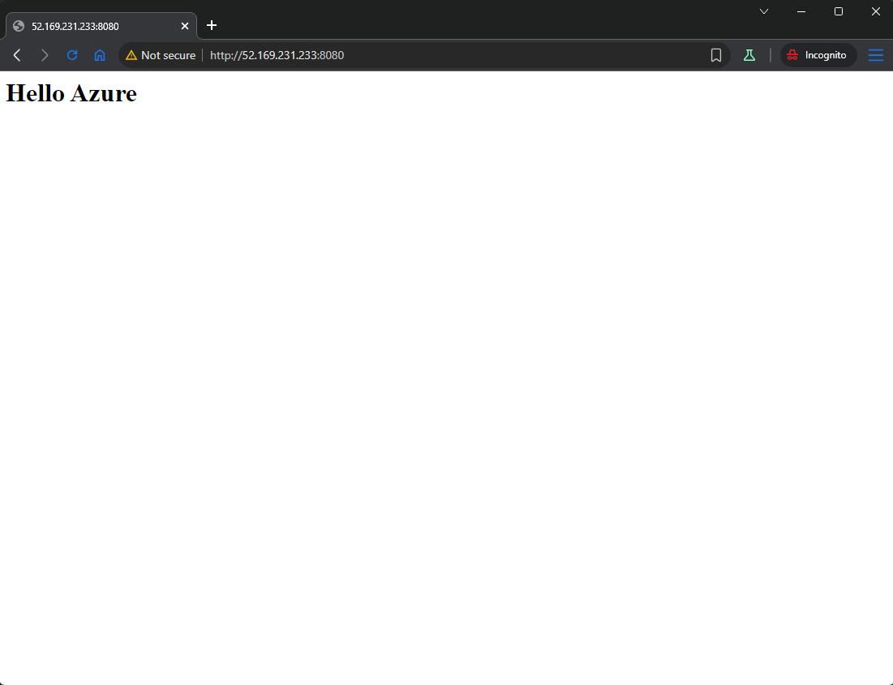

1. Validate

```sh
terraform init
terraform fmt -recursive
terraform validate
terraform plan -var-file="values.tfvars"
```

2. Apply

```sh
terraform apply -var-file="values.tfvars"
```

3. Get Public IP

```sh
az vm show -g homework-m1-rg -n homework-m1-vm -d --query publicIps -o tsv

# Output
52.169.231.233
```

4. Check Apache server from outside
   

5. Format and mount the new disk

- ssh to VM

```sh
ssh -i ~/.ssh/id_rsa azure-admin@52.169.231.233
```

- Create partition

```sh
sudo parted /dev/sdc --script mklabel gpt mkpart primary ext4 0% 100%
```

- Format partition

```sh
sudo mkfs.ext4 /dev/sdc1
```

- create mounting point

```sh
sudo mkdir -p /mnt/data
```

- mount drive to mounting point

```sh
sudo mount /dev/sdc1 /mnt/data
```

- add mount in `/etc/fstab`

```sh
echo '/dev/sdc1 /mnt/data ext4 defaults,nofail 0 2' | sudo tee -a /etc/fstab
```

- check with `lsblk`

```sh
$ lsblk
NAME    MAJ:MIN RM  SIZE RO TYPE MOUNTPOINTS
loop0     7:0    0 63.8M  1 loop /snap/core20/2599
loop1     7:1    0 89.4M  1 loop /snap/lxd/31333
loop2     7:2    0 49.3M  1 loop /snap/snapd/24792
sda       8:0    0   30G  0 disk
├─sda1    8:1    0 29.9G  0 part /
├─sda14   8:14   0    4M  0 part
└─sda15   8:15   0  106M  0 part /boot/efi
sdb       8:16   0    4G  0 disk
└─sdb1    8:17   0    4G  0 part /mnt
sdc       8:32   0   20G  0 disk
└─sdc1    8:33   0   20G  0 part /mnt/data
sr0      11:0    1  628K  0 rom
```

6. Delete Resource group with all services.

```sh
az group delete \
--name homework-m1-rg \
--yes \
--no-wait
```
