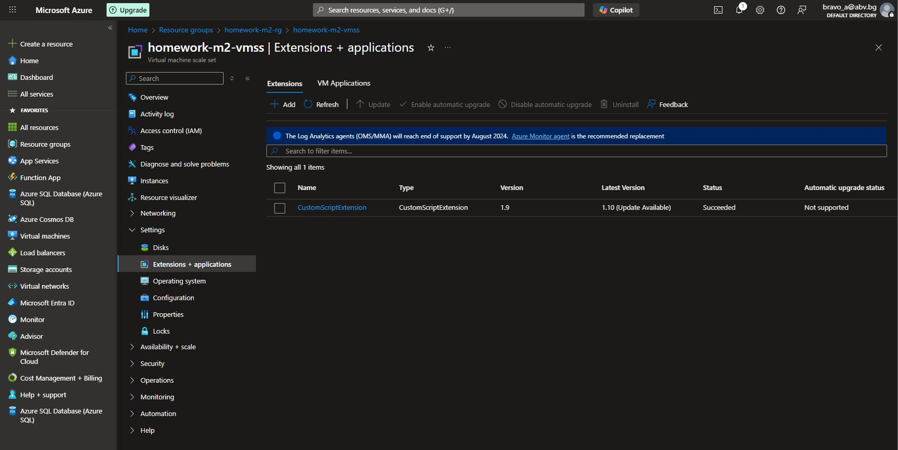
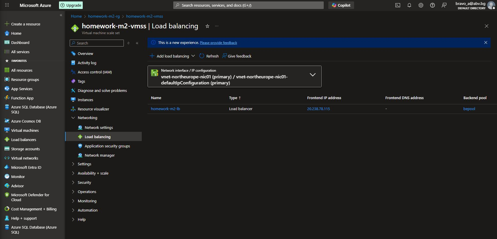

#### 01. Create new `Resource group` with name `homework-m2-rg`

#### 02. Create `Virtual Machine Scale Set` inside out resource group


Basics:

- Set name to `homework-m2-vmss`
- Set proper **Region**
- Available zone set no None
- Security type set to Standard
- Set instance count to 0, we are not ready with network settings
- Set image to Windows Server 2022 Datacenter
- Set username and password

Networking:

- Edit Network interface
  - Select inbound ports (80 and 22)
  - Disable public IP address
- Set `Load balancing options` to `Azure load balancer`
  - Create a load balancer


Resource visualizer


#### 3. Set outbound communication (Home -> Resource group -> Load Balancer)

- Outbound rules - Create new outbound rule with
  - Set rule name
  - Select frontend IP address (we have only one)
  - Select Backend poll (we have only one)
  - Enable default port allocation

With this rule we are sure that VMs will have external access to Internet.

#### 4. Add Custom script to install IIS + custom index page

- Prepare PowerShell script to add ISS feature and create custom `Default.htm`.

```powershell
Add-WindowsFeature Web-Server
Add-Content -Path "C:\inetpub\wwwroot\Default.htm" -Value $env:computername
```

- Create Storage account with container to store the script

- Open VMSS -> Settings -> Extensions + applications
  - Add **Custom script extension**.
  - Upload the script to install ISS and add custom index page.



#### 5. Change instance count from 0 to 2 (Home -> Resource group -> Virtual Machine Scale Set)

- Availability + scale -> Scaling - Change `Instance count` from 0 to 2 and save configuration.


Resource visualizer


#### 6. Check custom index page from internet

- Check Load balancer public IP address (Home -> Resource group -> VMSS -> Networking -> Load balancer)



- Open http://20.238.78.115


#### 7. Delete Resource group
