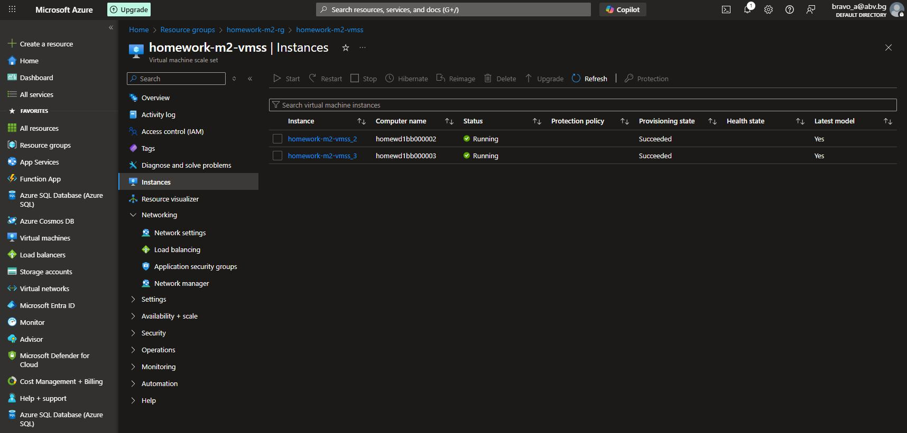
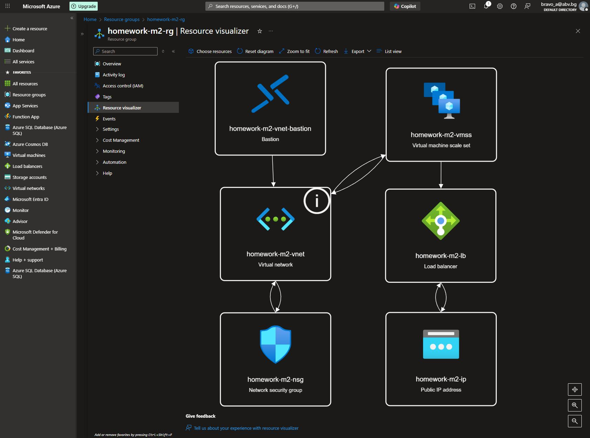
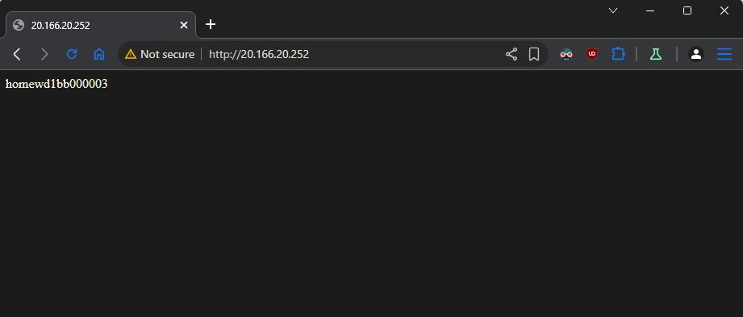

#### 1. Login to Azure and check subscription

```sh
# login
az login

# check subscription
az account subscription list
```

#### 2. Create Azure Resource group

```sh
az group create --name homework-m2-rg --location northeurope

#Output
{
  "id": "/subscriptions/ede4771c-fc75-42d7-9d7f-e2250e8cf5d4/resourceGroups/homework-m2-rg",
  "location": "northeurope",
  "managedBy": null,
  "name": "homework-m2-rg",
  "properties": {
    "provisioningState": "Succeeded"
  },
  "tags": null,
  "type": "Microsoft.Resources/resourceGroups"
```

#### 2. Network prerequisites

- Create Network Security Group

```sh
az network nsg create \
--resource-group homework-m2-rg \
--name homework-m2-nsg
```

- Add inbound rule to allow HTTP (port 80)

```sh
az network nsg rule create \
--resource-group homework-m2-rg \
--nsg-name homework-m2-nsg \
--name homework-m2-allowhttp \
--priority 100 \
--direction Inbound \
--access Allow \
--protocol Tcp \
--destination-port-ranges 80
```

- Create Virtual Network and one subnet before creating a VMSS.

```sh
az network vnet create \
  --resource-group homework-m2-rg \
  --name homework-m2-vnet \
  --address-prefix 10.0.0.0/16 \
  --subnet-name homework-m2-subnet \
  --subnet-prefix 10.0.0.0/24 \
  --network-security-group homework-m2-nsg
```

- Create Load Balancer
  - Create public IP address for Load balancer frontend
  ```sh
    az network public-ip create \
    --resource-group homework-m2-rg \
    --name homework-m2-ip \
    --sku Standard \
    --allocation-method static
  ```
  - Create Load Balancer
  ```sh
    az network lb create \
    --resource-group homework-m2-rg \
    --name homework-m2-lb \
    --sku Standard \
    --public-ip-address homework-m2-ip \
    --frontend-ip-name homework-m2-fe \
    --backend-pool-name homework-m2-bep
  ```
  - Create a health probe for port 80
  ```sh
    az network lb probe create \
    --resource-group homework-m2-rg \
    --lb-name homework-m2-lb \
    --name homework-m2-hp \
    --protocol Tcp \
    --port 80
  ```
  - Create rule to allow frontend:80 to backend:80
  ```sh
    az network lb rule create \
    --resource-group homework-m2-rg \
    --lb-name homework-m2-lb \
    --name homework-m2-http \
    --protocol Tcp \
    --frontend-port 80 \
    --backend-port 80 \
    --frontend-ip-name homework-m2-fe \
    --backend-pool-name homework-m2-bep \
    --probe-name homework-m2-hp \
    --disable-outbound-snat true
  ```
  - Create outbound rule (if we want MVs to have access to internet)
  ```sh
    az network lb outbound-rule create \
    --resource-group homework-m2-rg \
    --lb-name homework-m2-lb \
    --name homework-m2-outrule \
    --frontend-ip-configs homework-m2-fe \
    --address-pool homework-m2-bep \
    --protocol Tcp \
    --idle-timeout 30
  ```

#### 3. Create Azure Virtual Machine Scale Set into our resource group

```sh
az vmss create \
--resource-group homework-m2-rg \
--name homework-m2-vmss \
--orchestration-mode Uniform \
--admin-password "New_123123123" \
--admin-username azadmin \
--instance-count 2 \
--image Win2022Datacenter \
--vm-sku Standard_D2s_v3 \
--vnet-name homework-m2-vnet \
--subnet homework-m2-subnet \
--lb homework-m2-lb \
--backend-pool-name homework-m2-bep
```

Instances


Resource visualizer


#### 4. Add custom script extension to add ISS and set custom page.

```sh
az vmss extension set \
--resource-group homework-m2-rg \
--vmss-name homework-m2-vmss \
--name CustomScriptExtension \
--publisher Microsoft.Compute \
--version 1.10 \
--settings @iis-set.json
```

- Push changes to VMs

```sh
az vmss update-instances \
--resource-group homework-m2-rg \
--name homework-m2-vmss \
--instance-ids "*"
```

#### 5. Check the web server from Internet.

- Take the public IP address.

```sh
az network public-ip show \
--resource-group homework-m2-rg \
--name homework-m2-ip \
--query "ipAddress" \
--output tsv

# Output
20.166.20.252
```

- Check the website via browser



#### 6. Delete Resource group

```sh
az group delete \
--name homework-m2-rg \
--yes \
--no-wai
```
