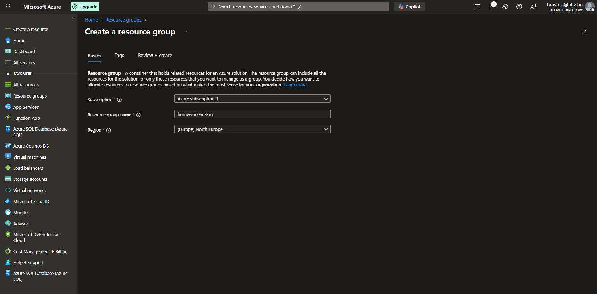

## Cosmos DB task

#### 1. Create an account that is set to use API for MongoDB

- Create new **Resource group** with name `homework-m3-rg`



- Select the new resource group. Search for _Azure Cosmos DB for MongoDB_ and click it.


- For the **Azure Cosmos DB Account** select preferred type of resource. For test purposes we will use **Request unit (RU)**

[See documentation to learn about vCore and RU differences ](https://learn.microsoft.com/en-us/azure/cosmos-db/mongodb/choose-model)


- Set **Create Azure Cosmos DB Account - Azure Cosmos DB for MongoDB**

  **Basics**

  - **Workload Type** - Learning (_Best for beginners. Low cost, easy setup, and quick exploration to learn Azure Cosmos DB._)
  - **Resource Group** - Select resource group created for task.
  - **Account Name** - Set username (_homework-m3-mongodb-acc_)
  - **Location** - Select proper location (_same as Resource group_)
  - **Capacity mode** - Provisioned throughput
  - **Apply Free Tier Discount** - Apply (_this will give us free 1000 RU_)
  - **Limit total account throughput** - Uncheck the checkbox

  **Global distribution**

  - Make sure that both are **Disable** (_Not needed for out test purposes_)

  **Backup Policy**

  - **Backup storage redundancy** - Select _Locally-redundant backup storage_ for lower cost.

- **Review + create** -> **Create**


#### 2. Create a database and a collection to store the data

- Select **Account** navigate to **Data Explorer** and click **+ New Collection** - This step will create a Database with a Collection.


- Setup Database and Collection
  - **Database name** - Set DB name (_homework-m3-personal-data-db_)
  - **Collection id** - Set Collection id (_homework-m3-pd-collection_)
  - **Sharding** - we will try with **Shared**
  - **Shared key** - we can use `sex` as shared key because we will querying by this field.
  - **Collection throughput (autoscale)** - Keep _Autoscale_


#### 3. Enter a few (at least five) items (documents) that hold personal data (id, name, sex, salary)

- Create new documents in format

```json
{
  "id": 8,
  "name": "Ceco",
  "sex": "M",
  "salary": 3200
}
```


#### 4. Write a query (in the MongoDB shell) to show the average salary by sex

- Open **Mongo Shell** - Switch to db

```sh
use homework-m3-personal-data-db
```

- Show all entries

```sh
db["homework-m3-pd-collection"].find({})
```

- Query db with "average salary by sex"

```sh
db["homework-m3-pd-collection"].aggregate([ { $group: { _id: "$sex", "Avgerage Salary": { $avg: "$salary" } } } ])

# Output
[
    { _id: 'F', 'Avgerage Salary': 6750 },
    { _id: 'M', 'Avgerage Salary': 5950 }
]
```


## Stream Analytics task

#### 1. Create a Stream Analytics job

- Create new **Resource group** for this task with name `homework-m3-rg-asa`
- Create new **Storage Account** in new Resource group (`hwm3sa`)
  - **Redundancy** - Select _Locally-redundant storage (LRS)_ for lower cost.
- Create new **Container** inside our new Storage account (`asa-container`)


- Create **Stream Analytics job** inside our Resource group.


**Basis** - **Name** - `homework-m3-saj`
**Storage** - **Add storage account** - check the box and select Storage account that has been created above.

#### 2. Prepare one input to read data from a BLOB.

- Go to resource -> **Job topology** and select **Inputs** -> create new input of type Blob storage.
  - **Input alias** - `asa-container-in`
  - **Path pattern** - `in`


#### 3. Prepare one output to send data to an Azure SQL database


- Create **SQL Database**

  **Basic**

  - **Database name** - `homework-m3-db`
  - **Server** - Create new (`homework-m3-db-server`, Use SQL authentication)
  - **Compute + storage** - Can select from **vCore** or **DTU**
  - **Backup storage redundancy** - Select _Locally-redundant backup storage_ for lower cost.

  **Networking**

  - **Connectivity method** - Select public endpoint (may need for test purposes)
  - **Add current client IP address** - Yes

- Go to **Stream Analytics job** -> **Job topology** and select **Outputs** -> create new input of type _SQL Database_.
  - **Output alias** - `asa-container-out`
  - **Database** - select new created SQL Database
  - **Table** - `Sensors`
  - Provide DB credentials


- Create "Sensors" table -> Open `homework-m3-db`-> Query editor

```sql
CREATE TABLE Sensors (
    Id INT IDENTITY(1,1) PRIMARY KEY,
    SensorName NVARCHAR(50),
    MeasureId BIGINT,
    MeasureAt DATETIME,
    Temperature FLOAT
);
```

- Go back to **Service Account** select `asa-container` and upload one json file into `input` folder (folder will be created with first upload).


#### 4. Create a query to transform the data in a form suitable for storing the data in a SQL database .

```sql
SELECT
    Sensor AS SensorName,
    Measurement.[Index] AS MeasureId,
    Measurement.Taken AS MeasureAt,
    Measurement.Value AS Temperature
INTO
    [asa-container-out]
FROM
    [asa-container-in]
```

- Generate some data with **AzureBlobJsonGenerator**

  - Take **Storage account** -> **Security + Networking** -> **Access keys** -> copy and paste **Connection string** into conf file.
  - Set `Blob container` to `asa-container` (we set this before)
  - Set `LocalTempPath` - what you want (there will be stored generated files locally).

- Start Stream Analytics job before start generation of data


- Check data inside SQL Database with Table "Sensors"


#### 5. Create a visualization of the data from the Azure SQL database in a Power BI Desktop application

- Take Database SQL **Server name** from Azure portal and fill _Server_ and _Database_


- Load data


- Create simple **Line chart** for sensors temperature during time.


