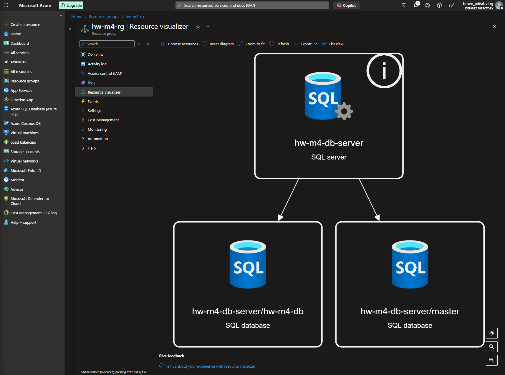
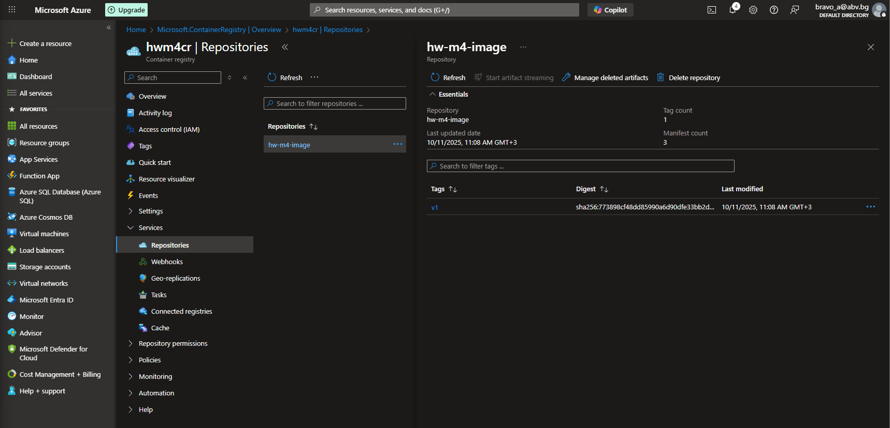
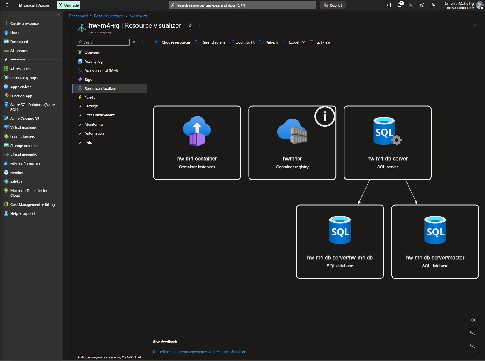
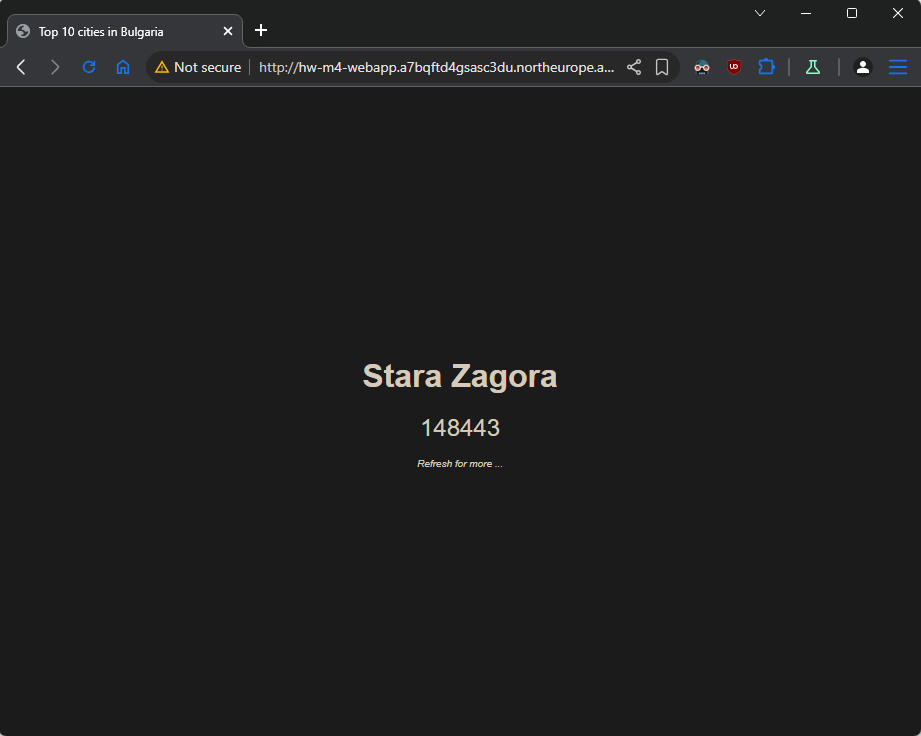

## Tasks

#### 1. Create SQL Database and initialize it from the db/seed.sql file in the supporting files

- Create new **Resource group** with name `hw-m4-rg`
- Create **Azure SQL** resource -> **Azure SQL Database** -> Show options -> Create SQL logical server

  **Basics**

  - **Server name** - `hw-m4-db-server`
  - **Location** - same as **Resource group**
  - **Authentication method** - Select **_Use SQL authentication_**

  **Networking**

  - **Allow Azure services and resources to access this serve** - Yes

    _No changes on other tabs_

  - **Review + create** -> **Create**

- Open **Azure SQL server** resource -> Create database

  **Basics**

  - **Database name** - `hw-m4-db`
  - **Compute + storage** -> Configure database -> Service tire -> DTU-based -> Basic (we are aiming as muc as possible lower price)
  - **Backup storage redundancy** - Locally-redundant backup storage

  **Networking**

  - **Add current client IP address** - Yes
    _No changes on other tabs_
  - **Review + create** -> **Create**

- Initialize SQL database with `db/seed.sql`

  - Open database -> **Query editor\*** -> paste code from `db/seed.sql` in Query window and Run the code.

  \*If we had problem to access the database via Query editor, we should go on db server open Security -> Networking and click `Add your client IPv4 address`

**Resource visualizer**



#### 2. Get the PHP (sql extension) connection string and use it later in the application’s code

- Open database -> **Settings** -> **Connection strings** -> select **PHP** tab -> Copy the "SQL Server Extension Sample Code" string

```php
$connectionInfo = array("UID" => "azadmin", "pwd" => "{your_password_here}", "Database" => "hw-m4-db", "LoginTimeout" => 30, "Encrypt" => 1, "TrustServerCertificate" => 0);
$serverName = "tcp:hw-m4-db-server.database.windows.net,1433";
$conn = sqlsrv_connect($serverName, $connectionInfo);
```

#### 3. Create a container image out of the application that is included in the `app/` folder in the supporting files For base image use `shekeriev/php:8.3-apache-sql`.

- Open `app/index.php` and paste the **Connection string** from point 2 under the specified line.
  > Change {your_password_here} with Database password!
- Crate **Dockerfile** inside application folder with following content.

```dockerfile
FROM shekeriev/php:8.3-apache-sql
COPY . /var/www/html/
```

- Create image from Dockerfile

```sh
$ docker build . -t hw-m4-image

$ docker images
REPOSITORY                      TAG       IMAGE ID       CREATED              SIZE
hw-m4-image                     latest    773898cf48dd   About a minute ago   762MB
```

#### 4. Create a container registry and publish your application container image there

- Inside out **Resource group** search and create **Container registry**

  **Basics**

  - **Registry name** - `hwm4cr`
  - **Pricing plan** - Basic or Standard
    _No changes on other tabs_
  - **Review + create** -> **Create**

- Activate admin access to **Container registry** -> **Settings** -> **Access keys** -> check _Admin user_

- Authenticate docker to access our Azure Container registry
  - Login Azure via `az`
  ```sh
  az login
  ```
  - login to **Container registry**
  ```sh
  az acr login --name hwm4cr
  Login Succeeded
  ```
- Tag our image for Azure remote registry

```sh
$ docker tag hw-m4-image hwm4cr.azurecr.io/hw-m4-image:v1

$ docker images
REPOSITORY                      TAG       IMAGE ID       CREATED          SIZE
hw-m4-image                     latest    773898cf48dd   21 minutes ago   762MB
hwm4cr.azurecr.io/hw-m4-image   v1        773898cf48dd   21 minutes ago   762MB
```

- Push image to remote registry

```sh
$ docker push hwm4cr.azurecr.io/hw-m4-image:v1
The push refers to repository [hwm4cr.azurecr.io/hw-m4-image]
bef1b237c949: Pushed
c52a2be77c77: Pushed
f007394c5662: Pushed
23c958fb5105: Pushed
2051e0e35a8a: Pushed
fd1cc4d14b9d: Pushed
5a9d72b3b895: Pushed
56c66cb68b0f: Pushed
e1caac4eb9d2: Pushed
e055748d0b38: Pushed
9e050c959e73: Pushed
91e7d6fbd267: Pushed
e161ced22c1e: Pushed
8c386db9cb1d: Pushed
686fbee431d9: Pushed
03905230498a: Pushed
9c790c1c009d: Pushed
0c022f1d0edd: Pushed
v1: digest: sha256:773898cf48dd85990a6d90dfe33bb2d159caeb6d6b874583bf7e0ce4f0508a03 size: 856
```

- Check the image in Azure Portal



#### 5. Create a container instance out of the published image and see if the application is working as expected

- Create new resource **Container Instances**

  **Basics**

  - **Container name** - `hw-m4-container`
  - **Image source** - select _Azure Container Registry_
  - **Registry** - select registry created above (`hwm4cr`)
  - **Image** - select image uploaded in point 4 (`hw-m4-image`)
  - **Image tag** - select if different versions

  **Networking**

  - **DNS name label** - set unique DNS name (`hw-m4-webapp`)
  - Ports - change if app inside container using different than port 80
    _No changes on other tabs_
  - **Review + create** -> **Create**

- **Resource visualizer**



- Copy **FQDN** of the container and paste it in browser


