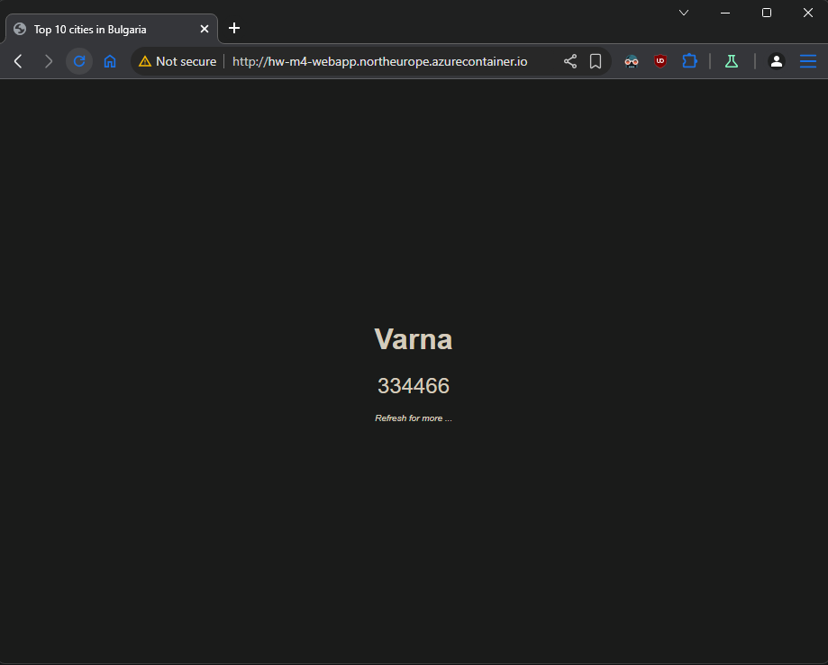

## Tasks

#### 1. Create SQL Database and initialize it from the db/seed.sql file in the supporting files

- Login Azure and create new **Resource group**

```sh
az group create --name hw-m4-rg --location northeurope
```

- Create logical SQL server

```sh
az sql server create \
--name hw-m4-db-srv \
--resource-group hw-m4-rg \
--location northeurope \
--admin-user sqladminuser \
--admin-password "New_123123" \
--enable-public-network true
```

- Allow all Azure services to access our SQL server (0.0.0.0 mean allow access from all Azure services and resources)

```sh
az sql server firewall-rule create \
--resource-group hw-m4-rg \
--server hw-m4-db-srv \
--name allow-azure-services \
--start-ip-address 0.0.0.0 \
--end-ip-address 0.0.0.0
```

- Allow specific public IP to access server

```sh
az sql server firewall-rule create \
--resource-group hw-m4-rg \
--server hw-m4-db-srv \
--name allow-my-ip \
--start-ip-address 46.10.209.232 \
--end-ip-address 46.10.209.232
```

- Create SQL database

```sh
az sql db create \
--resource-group hw-m4-rg \
--server hw-m4-db-srv \
--name hw-m4-db \
--service-objective Basic
```

- Initialize SQL database with `db/seed.sql`

```sh
cat ../db/seed.sql | tsql \
-H hw-m4-db-srv.database.windows.net \
-p 1433 \
-U sqladminuser \
-P "New_123123" \
-D hw-m4-db

# Check the table
echo "SELECT * FROM Cities;" | tsql \
  -H hw-m4-db-srv.database.windows.net \
  -p 1433 \
  -U sqladminuser \
  -P "New_123123" \
  -D hw-m4-db

# Output
locale is "en_US.UTF-8"
locale charset is "UTF-8"
using default charset "UTF-8"
Setting hw-m4-db as default database in login packet
1> 2> ID        CityName        Population
1       Sofia   1307376
2       Plovdiv 341625
3       Varna   334466
4       Burgas  203017
5       Stara Zagora    148443
6       Ruse    145765
7       Pleven  99628
8       Sliven  87895
9       Dobrich 86292
10      Veliko Tarnovo  73508
(10 rows affected)
```

#### 2. Get the PHP (sql extension) connection string and use it later in the application’s code

```sh
az sql db show-connection-string \
--client php \
--server hw-m4-db-srv \
--name hw-m4-db

# Output
"$connectionOptions = array(\"UID\"=>\"<username>@hw-m4-db-srv\", \"PWD\"=>\"<password>\", \"Database\"=>hw-m4-db, \"LoginTimeout\" => 30, \"Encrypt\" => 1, \"TrustServerCertificate\" => 0); $serverName = \"tcp:hw-m4-db-srv.database.windows.net,1433\"; $conn = sqlsrv_connect($serverName, $connectionOptions);"
```

#### 3. Create a container image out of the application that is included in the `app/` folder in the supporting files For base image use `shekeriev/php:8.3-apache-sql`

- Open app/index.php and paste the Connection string from point 2 under the specified line.
  > Replace **\<username\>@hw-m4-db-srv>** with Database admin username and **\<password\>** with admin password!
- Crate **Dockerfile** inside application folder with following content.

```dockerfile
FROM shekeriev/php:8.3-apache-sql
COPY . /var/www/html/
```

- Build image from Dockerfile

```sh
docker build . -t hw-m4-image

$ docker images
REPOSITORY                      TAG       IMAGE ID       CREATED              SIZE
hw-m4-image                     latest    773898cf48dd   About a minute ago   762MB
```

#### 4. Create a container registry and publish your application container image there

- Inside out **Resource group** create **Container registry**

```sh
az acr create \
--resource-group hw-m4-rg \
--name hwm4cr \
--sku Standard \
--admin-enabled true \
--public-network-enabled true
```

- Login to **Container registry**

```sh
az acr login --name hwm4cr
Login Succeeded
```

- Tag our image for Azure remote registry

```sh
docker tag hw-m4-image hwm4cr.azurecr.io/hw-m4-image:v1

docker images
REPOSITORY                      TAG       IMAGE ID       CREATED          SIZE
hw-m4-image                     latest    773898cf48dd   21 minutes ago   762MB
hwm4cr.azurecr.io/hw-m4-image   v1        773898cf48dd   21 minutes ago   762MB
```

- Push image to remote registry

```sh
docker push hwm4cr.azurecr.io/hw-m4-image:v1
The push refers to repository [hwm4cr.azurecr.io/hw-m4-image]
6862410d2209: Pushed
8b8bcef985ed: Pushed
03905230498a: Pushed
23c958fb5105: Pushed
686fbee431d9: Pushed
5a9d72b3b895: Pushed
f007394c5662: Pushed
0c022f1d0edd: Pushed
e1caac4eb9d2: Pushed
8c386db9cb1d: Pushed
91e7d6fbd267: Pushed
bef1b237c949: Pushed
e055748d0b38: Pushed
56c66cb68b0f: Pushed
9e050c959e73: Pushed
c52a2be77c77: Pushed
2051e0e35a8a: Pushed
9c790c1c009d: Pushed
v1: digest: sha256:ee95d3e9d1e4c0c9cd7beec21e592e4a98fd154953bf43bff192b0f7c3d2cde6 size: 856
```

#### 5. Create a container instance out of the published image and see if the application is working as expected

- Take Azure Container registry password

```sh
export ACR_PASSWORD="$(az acr credential show --name hwm4cr --query 'passwords[0].value' -o tsv | tr -d '\r\n')"
```

- Create container from our image `hwm4cr.azurecr.io/hw-m4-image:v1`

```sh
az container create \
--resource-group hw-m4-rg \
--name hw-m4-container \
--image hwm4cr.azurecr.io/hw-m4-image:v1 \
--dns-name-label hw-m4-webapp \
--ports 80 \
--os-type linux \
--cpu 1 \
--memory 1.5 \
--location northeurope \
--registry-login-server hwm4cr.azurecr.io \
--registry-username hwm4cr \
--registry-password "$ACR_PASSWORD"
```

- Take FQDN of our container

```sh
az container show -g hw-m4-rg -n hw-m4-container --query "{FQDN:ipAddress.fqdn}"

#Output
{
  "FQDN": "hw-m4-webapp.northeurope.azurecontainer.io"
}
```

- Check web site

```sh
curl http://hw-m4-webapp.northeurope.azurecontainer.io
<!doctype html>

<html lang="en">
    <head>
        <meta charset="utf-8" />
        <meta name="viewport" content="width=device-width" />
        <title>Top 10 cities in Bulgaria</title>
        <link rel="stylesheet" type="text/css" href="/index.css" media="screen">
    </head>
    <body>
        <div class="container">
<div class="item" id="item-city">Veliko Tarnovo</div>
<div class="item" id="item-population">73508</div>
<div class="item" id="item-note">Refresh for more ...</div>
        </div>
    </body>
</html>%
```



#### Delete **Resource group**

```sh
az group delete \
--name hw-m4-rg \
--yes \
--no-wait
```
