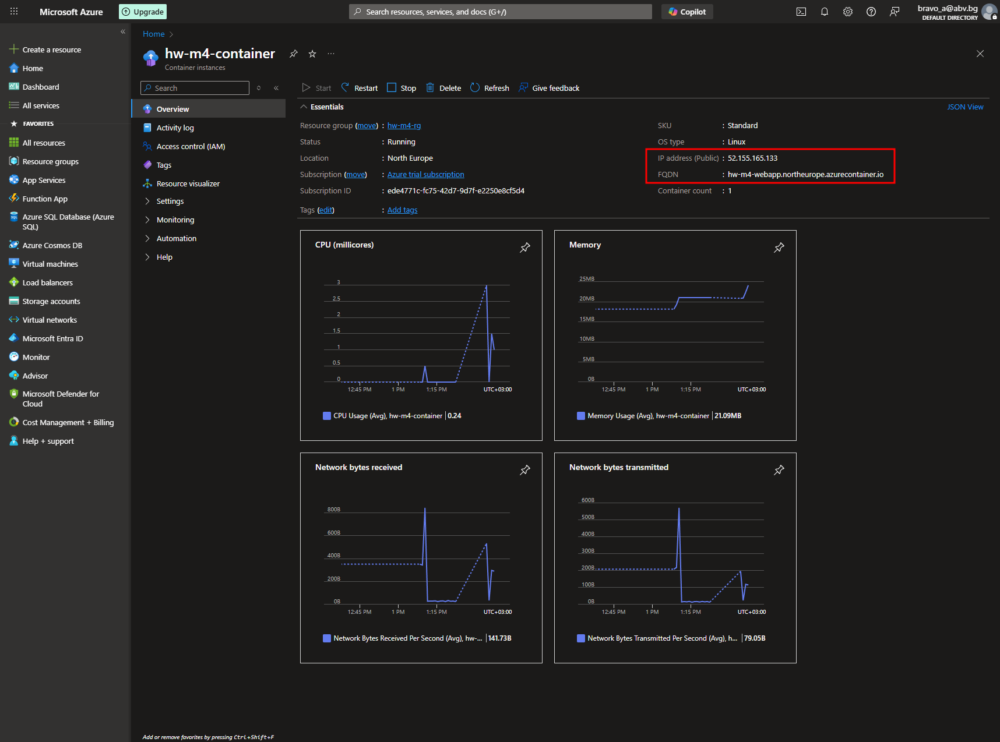
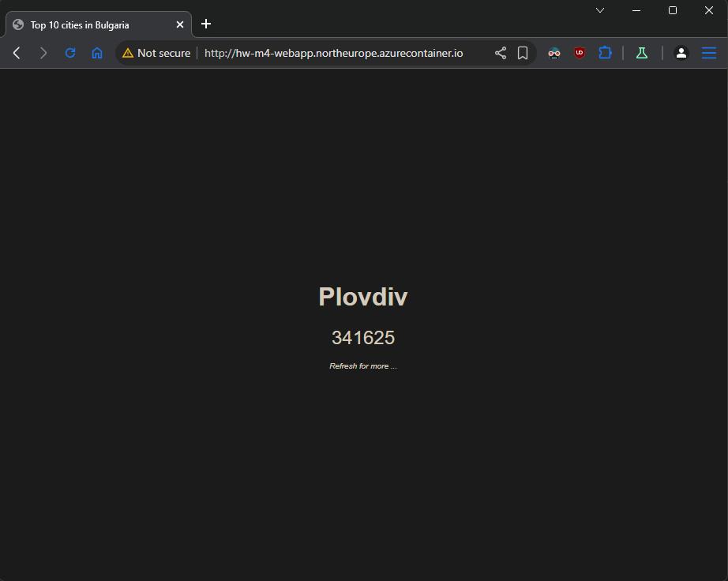

## Tasks

#### Preparation stage

Create a Docker image and tag the image to be pushed to **Azure Container registry**. Use PHP connection string in `app/index.php` with prepared:

> - SQL_ADMIN_USER
> - SQL_ADMIN_PASS
> - SQL_DB_NAME
> - SQL_SERVER_NAME
>
> ```php
> $connectionOptions = array("UID" => "SQL_ADMIN_USER", "PWD" => "SQL_ADMIN_PASS", "Database" => "SQL_DB_NAME", "LoginTimeout" => 30, "Encrypt" => 1, "TrustServerCertificate" => 0);
> $serverName = "tcp:SQL_SERVER_NAME.database.windows.net,1433";
> $conn = sqlsrv_connect($serverName, $connectionOptions);
> ```

- Create **Dockerfile**

```Dockerfile
FROM shekeriev/php:8.3-apache-sql
COPY . /var/www/html/
```

- Build image from **Dockerfile**

```sh

$ docker images
REPOSITORY                      TAG       IMAGE ID       CREATED              SIZE
hw-m4-image                     latest    773898cf48dd   About a minute ago   762MB
```

- Tag image for Azure **Container registry**

```sh
$ docker tag hw-m4-image hwm4cr.azurecr.io/hw-m4-image:v1

$ docker images
REPOSITORY                      TAG       IMAGE ID       CREATED          SIZE
hw-m4-image                     latest    773898cf48dd   21 minutes ago   762MB
hwm4cr.azurecr.io/hw-m4-image   v1        773898cf48dd   21 minutes ago   762MB
```

#### 1. Create SQL Database and initialize it from the `db/seed.sql` file in the supporting files

- Create `main.tf`, `variables.tf and `values.tfvars`

- Init terraform

```sh
terraform init
```

- Validate

```sh
terraform validate
```

- Apply

```sh
terraform apply -var-file="values.tfvars"
```

#### 2. Get the PHP (sql extension) connection string and use it later in the application’s code

```sh
az sql db show-connection-string \
--client php \
--server hw-m4-db-srv \
--name hw-m4-db

# Output
"$connectionOptions = array(\"UID\"=>\"<username>@hw-m4-db-srv\", \"PWD\"=>\"<password>\", \"Database\"=>hw-m4-db, \"LoginTimeout\" => 30, \"Encrypt\" => 1, \"TrustServerCertificate\" => 0); $serverName = \"tcp:hw-m4-db-srv.database.windows.net,1433\"; $conn = sqlsrv_connect($serverName, $connectionOptions);"
```

#### 3. Create a container image out of the application that is included in the `app/` folder in the supporting files. For base image use `shekeriev/php:8.3-apache-sql`.

- _Done in Preparation stage_

#### 4. Create a container registry and publish your application container image there

- _Done in point 1 with `main.tf`_

#### 5. Create a container instance out of the published image and see if the application is working as expected

- _Done in point 1 with `main.tf`_

- Container IP and FQDN



- Check container webapp with `curl`

```sh
curl http://hw-m4-webapp.northeurope.azurecontainer.io
<!doctype html>

<html lang="en">
    <head>
        <meta charset="utf-8" />
        <meta name="viewport" content="width=device-width" />
        <title>Top 10 cities in Bulgaria</title>
        <link rel="stylesheet" type="text/css" href="/index.css" media="screen">
    </head>
    <body>
        <div class="container">
<div class="item" id="item-city">Dobrich</div>
<div class="item" id="item-population">86292</div>
<div class="item" id="item-note">Refresh for more ...</div>
        </div>
    </body>
</html>
```

- Check via browser


