## Tasks

#### 1. AKS task

- **Create an AKS cluster with one node**

  - Create **Resource group** with name `hw-m5-rg`

- **Prepare a simple web app (single static HTML page) with one
  picture (or whatever you decide) and a text with your SoftUni ID**

  ```sh
  web-app
  ├── app.py
  ├── requirements.txt
  └── templates
      └── index.html
  ```

- **Create a Dockerfile to containerize the app**

  ```Dockerfile
  FROM python:3.13-slim

  # Create an user for app
  RUN groupadd -r appuser && useradd -r -g appuser appuser

  # Set working directory
  WORKDIR /app

  # Copy requirements first for better caching
  COPY requirements.txt .

  # Install requirements
  RUN pip install --no-cache-dir -r requirements.txt

  # Copy application code
  COPY . .

  # Change ownership to newly created user
  RUN chown -R appuser:appuser /app
  USER appuser

  EXPOSE 80

  # Run the application
  CMD ["python3", "app.py"]
  ```

- **Create an ACR and publish the app image there**

  - Create **Azure Container registry** with name `hwm5cr`.

  **Basics**
  Pricing plan -> Basic

  After created the **Container registry** follow the steps bellow:

  - Login **Azure** and select proper subscription.

  ```sh
  az login
  ```

  - Login to **Container registry**

  ```sh
  az acr login --name hwm5cr
  ```

  - Tag our image for Azure remote registry

  ```sh
  docker tag simple-web-app hwm5cr.azurecr.io/simple-web-app:v1
  ```

  - Push image to remote registry

  ```sh
  docker push hwm5cr.azurecr.io/simple-web-app:v1
  ```

  - Check the image in Azure Portal

  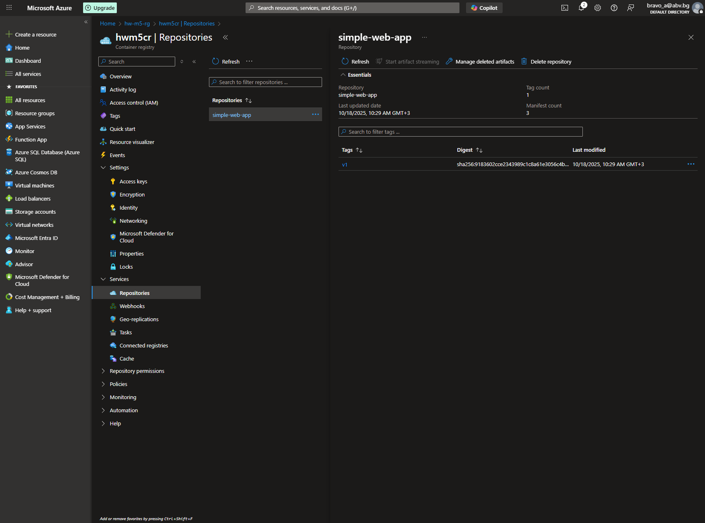

- **Create a manifest (or two) and deploy the app on the cluster**

  - Search and create **Kubernetes service** with name `hw-m5-k8s`

  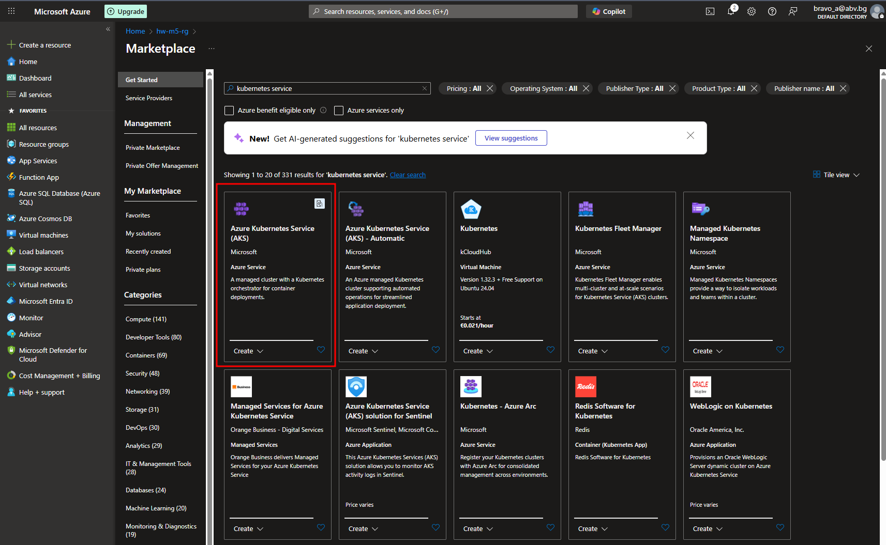

  - **Review**
    |**Basics**||
    |-|-|
    |Subscription| Azure trial subscription
    |Resource group| hw-m5-rg
    |Region| West Europe
    |Kubernetes cluster name| hw-m5-k8s
    |Kubernetes version| 1.32.7
    |Automatic upgrade| none
    |Automatic upgrade scheduler| -
    |Node security channel type| None
    |Security channel scheduler| -
    | **Node pools** ||
    | Node pools | 1 |
    | Enable virtual nodes | Disabled |
    | Node Auto-provisioning | Disabled |
    | **Access** | |
    | Resource identity | System-assigned managed identity |
    | Local accounts | Enabled |
    | Authentication and Authorization | Local accounts with Kubernetes RBAC |
    | Encryption type | (Default) Encryption at-rest with a platform-managed key |
    | **Networking** | |
    | Private cluster | Disabled |
    | Authorized IP ranges | Disabled |
    | Network configuration | Azure CNI Overlay |
    | DNS name prefix | hw-m5-k8s-dns |
    | Network policy | None |
    | Load balancer | Standard |
    | **Integrations** | |
    | Container registry resource group | hw-m5-rg |
    | Container registry | hwm5cr |
    | Service mesh | Disabled |
    | Azure Policy | Disabled |
    | **Monitoring** | |
    | Enable Container Logs | Disabled |
    | Enable Prometheus metrics | Disabled |
    | Enable Grafana | Disabled |
    | Alerts | Disabled |
    |**Advanced**||
    |Infrastructure resource group| MC_hw-m5-rg_hw-m5-k8s_westeurope
    |**Security**||
    |Microsoft Defender for Cloud| Free
    |OpenID Connect (OIDC)| Enabled
    |Workload Identity| Enabled
    |Image Cleaner| Enabled

  - Create new Namespace -> Open Cluster -> Kubernetes resources -> Namespaces -> Create `hwm5namespace`

  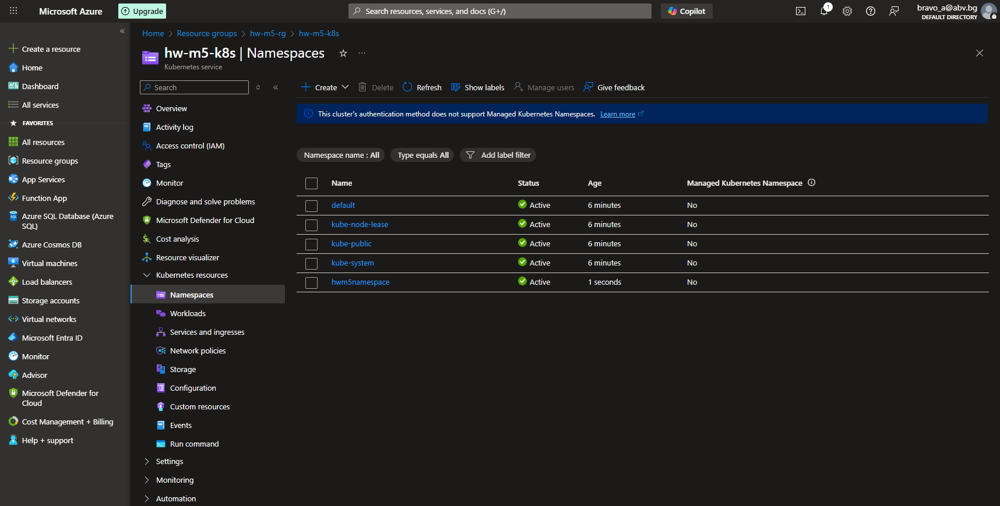

  - Check namespaces via Azure Portal console

  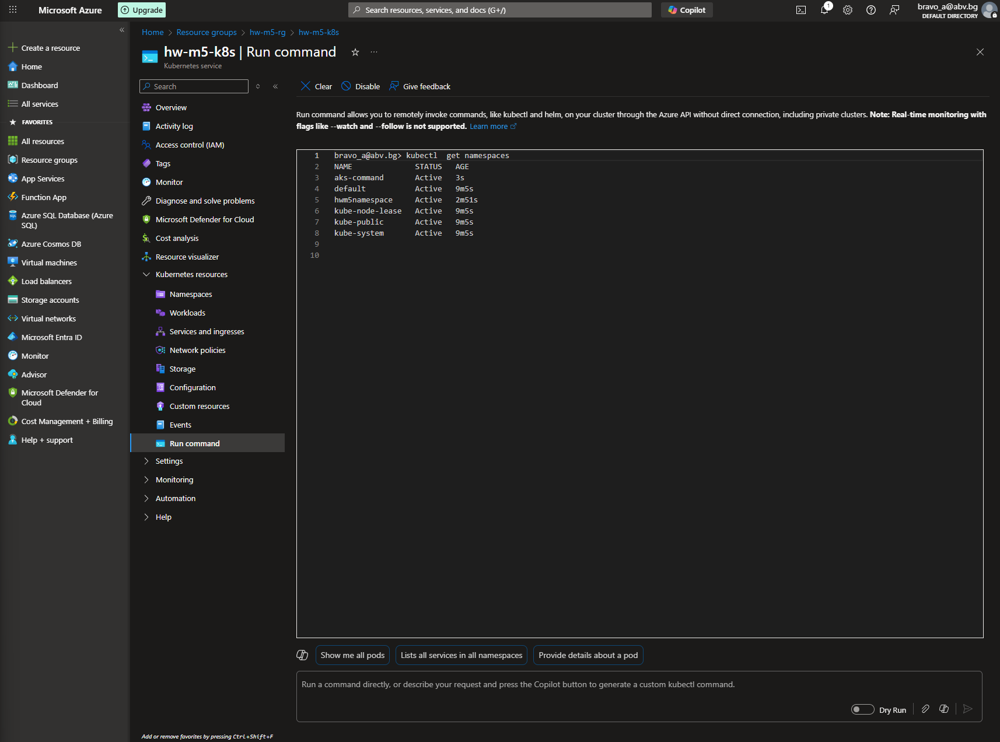

  - Prepare manifest file with deployment and service

  ```yml
  apiVersion: apps/v1
  kind: Deployment
  metadata:
    name: hw-m5-web-app
    namespace: hwm5namespace
    labels:
      app: hw
  spec:
    replicas: 1
    selector:
      matchLabels:
        app: hw
    template:
      metadata:
        labels:
          app: hw
      spec:
        containers:
          - name: app
            image: hwm5cr.azurecr.io/simple-web-app:v1
            imagePullPolicy: Always
            ports:
              - containerPort: 8080
  ---
  apiVersion: v1
  kind: Service
  metadata:
    name: hw-m5-svc
    namespace: hwm5namespace
  spec:
    type: LoadBalancer
    ports:
      - port: 80
        targetPort: 8080
        name: app-port
    selector:
      app: hw
  ```

  - Create via **Apply a YAML**

  ```sh
  $ kubectl apply -f deployment.yml
  namespace/hwm5namespace created
  deployment.apps/hw-m5-web-app created
  service/hw-m5-svc created

  $ kubectl get pods -n hwm5namespace
  NAME                             READY   STATUS    RESTARTS   AGE
  hw-m5-web-app-6c7fff7485-nxp9f   1/1     Running   0          5s
  ```

  - Check the IP address of service in Azure Portal

  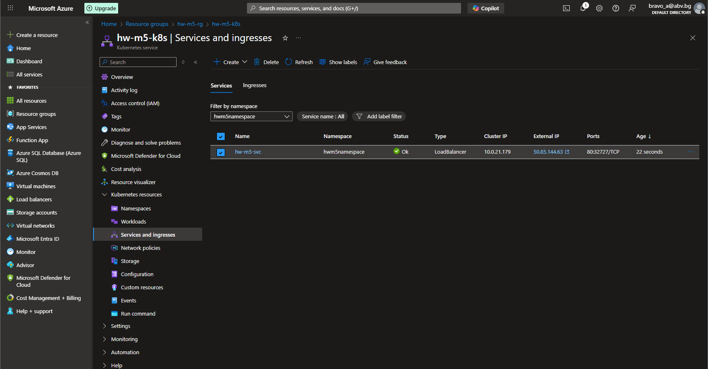

  - Open service external IP address in browser

  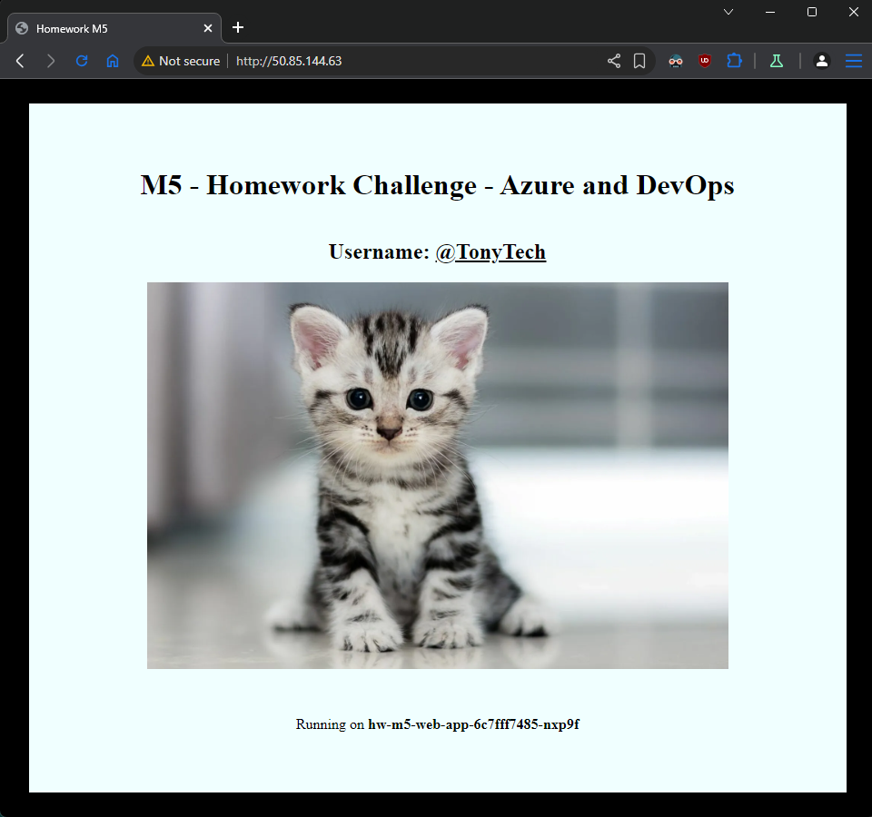

  - Change replicas to 10 and apply

  ```sh
  $ kubectl apply -f deployment.yml
  namespace/hwm5namespace unchanged
  deployment.apps/hw-m5-web-app configured
  service/hw-m5-svc unchanged

  $ kubectl get pods -n hwm5namespace
  NAME                             READY   STATUS    RESTARTS   AGE
  hw-m5-web-app-6c7fff7485-55hbx   1/1     Running   0          4s
  hw-m5-web-app-6c7fff7485-5dmc8   1/1     Running   0          4s
  hw-m5-web-app-6c7fff7485-9zm96   1/1     Running   0          4s
  hw-m5-web-app-6c7fff7485-k2p52   1/1     Running   0          4s
  hw-m5-web-app-6c7fff7485-lqnt6   1/1     Running   0          4s
  hw-m5-web-app-6c7fff7485-m4pk6   1/1     Running   0          4s
  hw-m5-web-app-6c7fff7485-nxp9f   1/1     Running   0          3m27s
  hw-m5-web-app-6c7fff7485-qnj7p   1/1     Running   0          4s
  hw-m5-web-app-6c7fff7485-rg95v   1/1     Running   0          4s
  hw-m5-web-app-6c7fff7485-vvgfd   1/1     Running   0          4s
  ```

  - Web application is served by new pod

  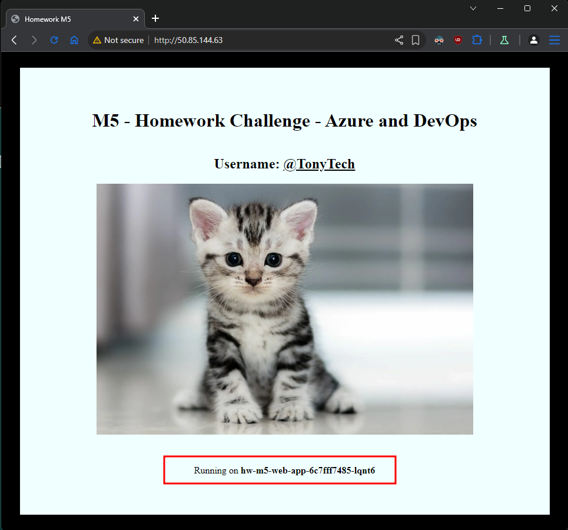

---

#### 2. DevOps task

- **Create a Web App for a runtime of your choice (one of .NET, Java,
  Python, or NodeJS)**

  - Create Web App with Python 3.13 runtime
  - Set port environmet -> select **Web App server** -> Settings -> Environment variables -> + Add -> Key: WEBSITES_PORT and Value: 8080
  - Configuration (preview) -> Stack settings -> Startup command use `gunicorn --bind 0.0.0.0:8000 app:app` -> Apply

- **Create a simple application in the chosen framework based on the
  PHP application used during the practice**

  - App folder `/web-app`

- **Create a DevOps project for the application that includes Repo and
  Pipeline and deploys the application to the Web App**

  - Search "Azure DevOps" -> View my organizations -> Create new organization -> create project inside organization

  - Create new repository - Select project -> Repos -> Initialize

  - Clone new repo locally

  ```sh
  git clone https://bravoa@dev.azure.com/bravoa/homework-m5/_git/homework-m5
  ```

  - Copy and Paste the application files into cloned repository
  - Push the changes to remote branch

  ```sh
  $ git add .
  $ git commit -m "add app files"
  $ git push
  ```

  - Check repo in Azure DEvOps Portal

  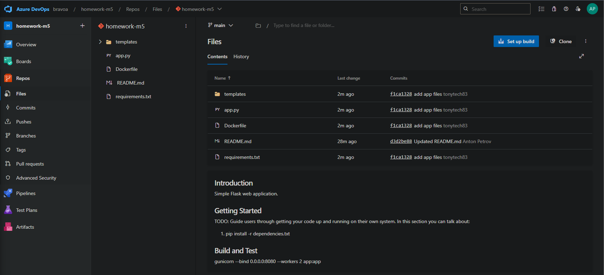

  - Project settings -> Service connection -> New service connection -> Azure Resource Manager -> Select proper subscription, Resource group where we created Web App server and set Service Connection Name -> Save

  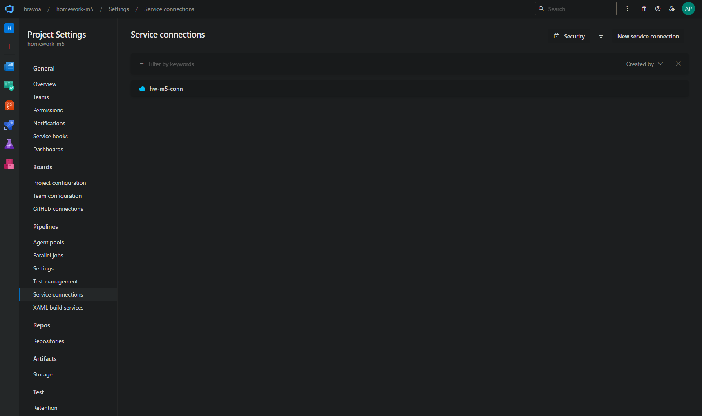

  - Take the id of new created Service connection

  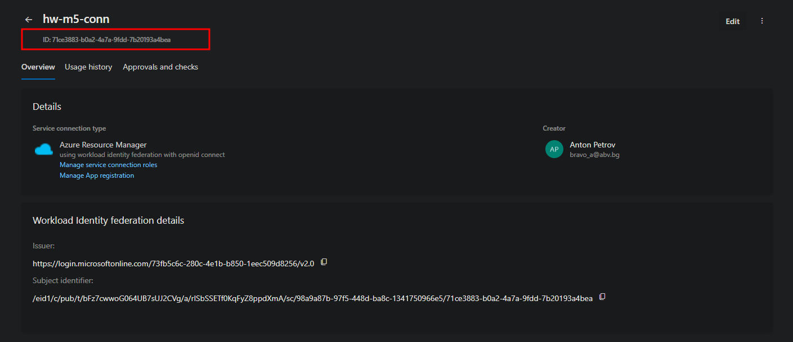

  - Create Pipeline - Select project -> Pipelines -> Create Pipeline -> Select repository -> Select **Python to Linux Web App on Azure** -> Select proper subscription -> Continue

  - In manifest file set `webAppName` to **Web App server** name and set `azureServiceConnectionId` to **Service connection** id from above. -> Save manifest.

  - Add Parallel jobs -> Project Settings -> Parallel jobs -> Microsoft-hosted click **Change** -> Select proper subscription -> Save -> Set **MS Hosted CI/CD** to 2 -> Save

  - Run new created **Pipeline**

  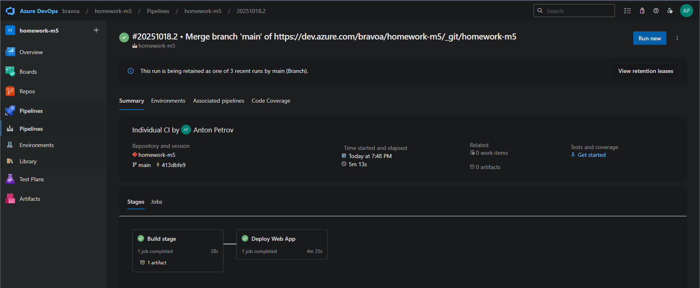

  - Check application in browser

  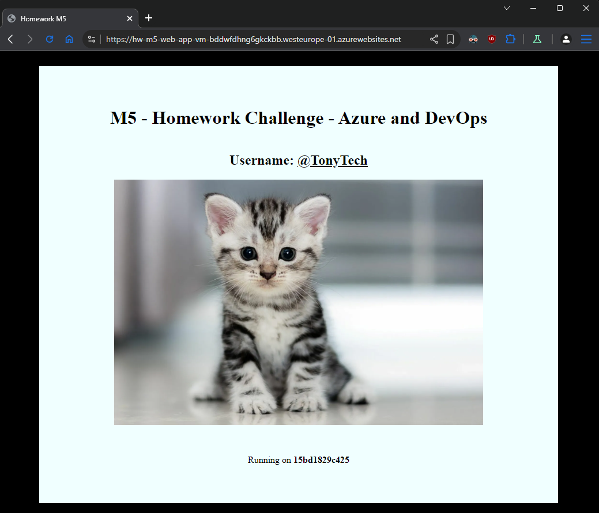
