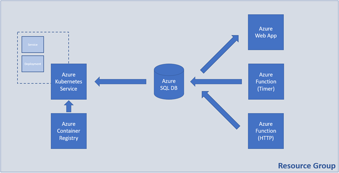

# Practice M6: All Together

For this module we will need a PC running recent version of **Windows**,
**Linux**, or **macOS**. It can be either physical or virtual machine

## Problem (Variant A)

You are expected to create the following set of resources:

### Tasks

#### Infrastructure - 5 tasks, 12 pts

- (T101, 1 pts) Create a resource group named **RG-Solution**

- (T102, 2 pts) Create an artifact (availability set or virtual machine
  scale set) that provides high availability for virtual machines and
  name it **AS-VM**

- (T103, 4 pts) Create a set of **two** **Ubuntu 22.04** (or newer)
  virtual machines each with a password set as an authentication method.
  If created in an availability set, name them **VM- x**, where **x** is
  a sequence number

- (T104, 3 pts) Create a container registry with **Basic** SKU

- (T105, 2 pts) Enable the Admin user

#### Networking - 5 tasks, 12 pts

- (T201, 1 pts) Create a virtual network named **NET** with address
  space **10.0.0.0/16**

- (T202, 2 pts) Create a subnet named **NET-SUB-VM** with address space
  **10.0.1.0/24**

- (T203, 2 pts) Create a network security group **SG-VM**, attach it to
  the **NET-SUB-VM** subnet, and create two **inbound** rules -- one to
  allow communication on port **22/tcp** and a second one to allow
  communication on port **80/tcp**

- (T204, 5 pts) Create an external load balancer named **LBP** with the
  corresponding set of backend pool, health probe, and load balancing
  rule that maps external port **80/tcp** to internal port **80/tcp**.
  It should have public IP address

- (T205, 2 pts) Create a set of NAT rules to allow connection over SSH
  to each VM

#### Databases - 3 tasks, 7 pts

- (T301, 3 pts) Create SQL Server and a database

- (T302, 2 pts) Configure connectivity to the server

- (T303, 2 pts) Initialize the database with the help of the
  **create-structures.sql** file part of the supporting files set

#### Containers and Images - 5 tasks, 10 pts

- (T401, 2 pts) Add the SQL connection string to the **config.php** file
  in the **docker/web** folder

- (T402, 2 pts) Build the Docker image from the **Dockerfile** that is
  in the **docker** folder

- (T403, 2 pts) Tag the Docker image for the Azure Container Registry

- (T404, 2 pts) Publish the Docker image to the Azure Container Registry

- (T405, 2 pts) Create container instance of the image and make sure
  that the app is working and showing correct results

#### Software and App Deployment - 8 tasks, 19 pts

- (T501, 3 pts) Install **Apache + PHP** on all **VMs**

- (T502, 2 pts) Install **all supplementary software** on all **VMs** to
  allow them to communicate with the SQL Server database

- (T503, 3 pts) Deploy and configure (add connection string) all **php
  files** (part of the supporting files set) to all VMs

- (T504, 2 pts) Have a fully working VM-based web application

- (T505, 3 pts) Create a PHP code-based (not container-based) web
  application (App Service) \*

- (T506, 2 pts) Add the SQL connection string to the **index.php** file
  in the **webapp** folder

- (T507, 2 pts) Deploy the web application code to Azure

- (T508, 2 pts) Make sure that the web app is working and showing
  correct results

## Problem (Variant B)

You are expected to create the following set of resources:

### Tasks

#### Infrastructure - 5 tasks, 14 pts

- (T101, 1 pts) Create a resource group named **RG-SolutionB**

- (T102, 3 pts) Create a container registry with **Basic** SKU

- (T103, 2 pts) Enable the Admin user

- (T104, 6 pts) Create an Azure Kubernetes Service resource with **one
  node** of size **B2s**

- (T105, 2 pts) **Link** the ACR to the AKS

#### Containers and Images - 7 tasks, 17 pts

- (T201, 2 pts) Add the SQL connection string to the **index.php** file
  in the **docker/web** folder

- (T202, 2 pts) Build the Docker image from the **Dockerfile** that is
  in the **docker** folder

- (T203, 2 pts) Tag the Docker image for the Azure Container Registry

- (T204, 2 pts) Publish the Docker image to the Azure Container Registry

- (T205, 3 pts) Adjust the **deployment.yaml** file in the **manifests**
  folder to point to the published Docker image

- (T206, 3 pts) Publish the manifests to the Kubernetes cluster (Azure
  Kubernetes Service)

- (T207, 3 pts) Make sure that the app is working and showing correct
  results

#### Databases - 3 tasks, 7 pts

- (T301, 3 pts) Create SQL Server and a database

- (T302, 2 pts) Configure connectivity to the server

- (T303, 2 pts) Initialize the database with the help of the
  **create-structures.sql** file part of the supporting files set

#### Web Apps and Functions - 8 tasks, 22 pts

- (T401, 3 pts) Create a PHP code-based (not container-based) web
  application (App Service) \*

- (T402, 2 pts) Add the SQL connection string to the **index.php** file
  in the **webapp** folder

- (T403, 2 pts) Deploy the web application code to Azure

- (T404, 2 pts) Make sure that the web app is working and showing
  correct results

- (T405, 3 pts) Create a code-based **Function App** with **.NET Core**
  as runtime \*

- (T406, 3 pts) Create a **Timer triggered** function. It must execute
  **every two minutes** and insert a row with **SubmittedName=TIMER** in
  the database (table **SubmittedItems**)

- (T407, 5 pts) Create an HTTP **triggered** function. When executed it
  must accept a single parameter (**name**) and store the value in the
  database (table **SubmittedItems**). If, however, executed without
  one, it should store an item with the label **EMPTY**

- (T408, 2 pts) Make sure that you have executed the HTTP triggered
  function successfully several times with various values for the
  parameter. For example, **EXAM**, **TEST**, etc.

_\* Note that you may need to create an additional resource group(s)_

## Clean up

Don't forget to stop and delete all resources that you won't need

You can delete a resource group with all referenced resources directly

If you have any doubts, visit the **All resources** option in **Azure
Portal** to check if there are any unnecessary resources left and delete
them manually
