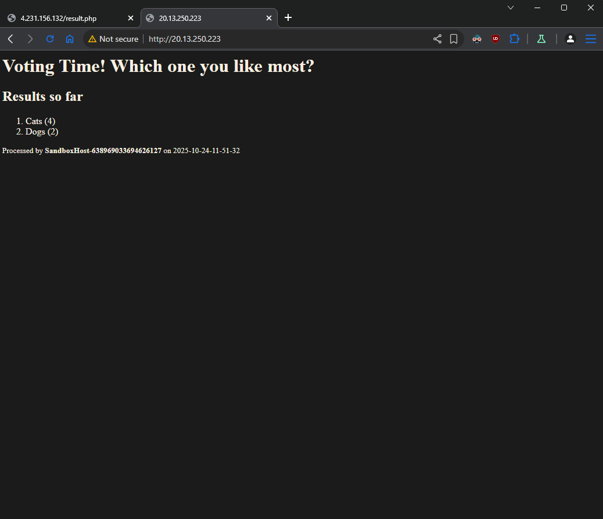
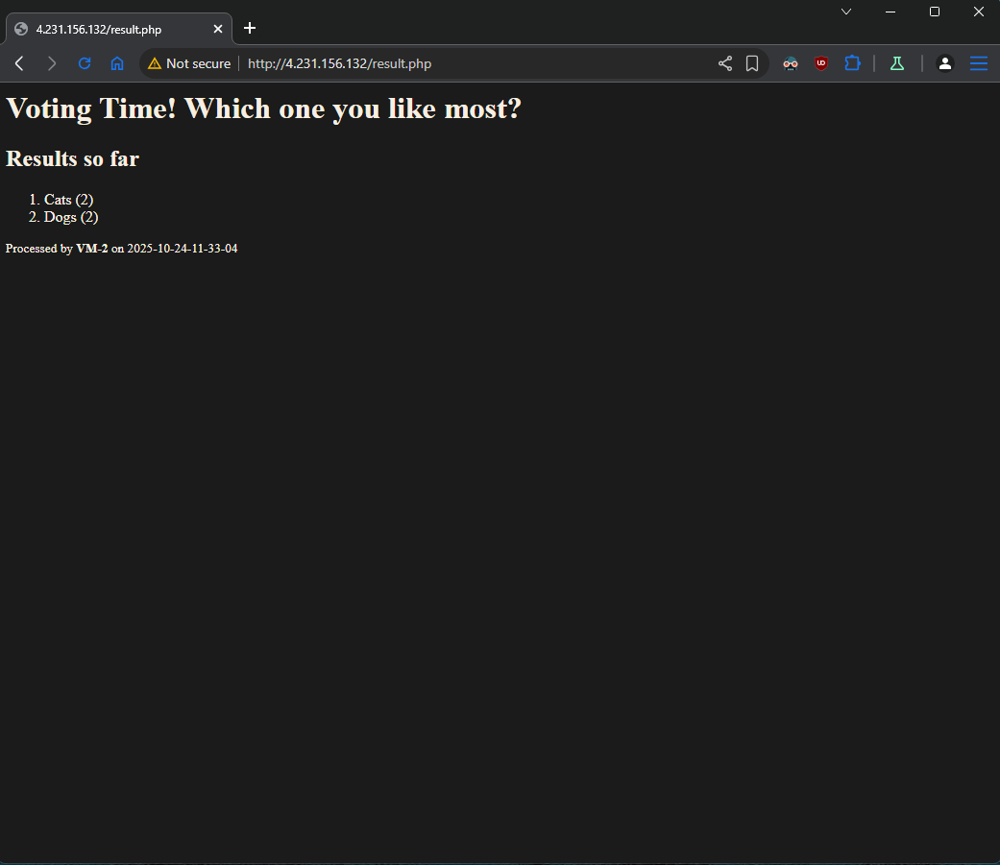
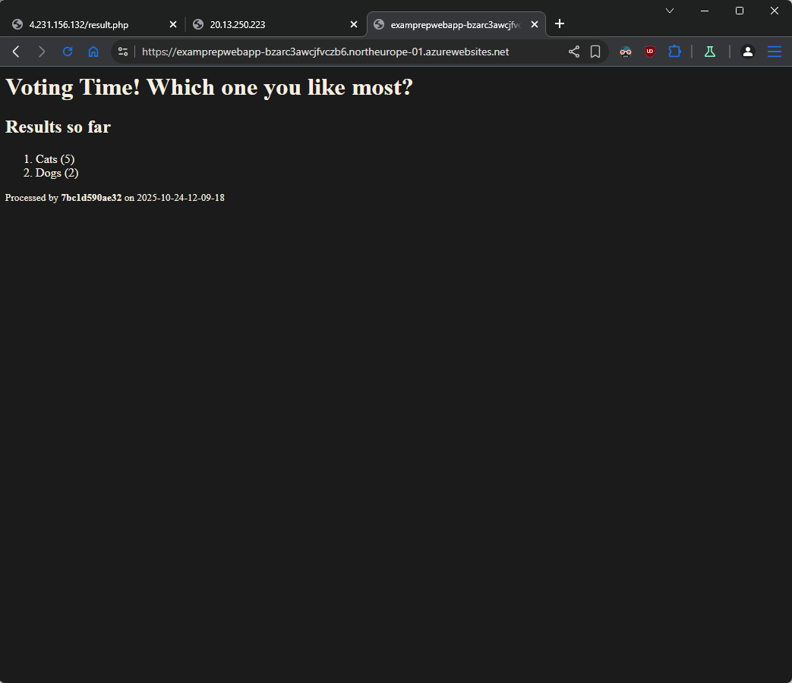
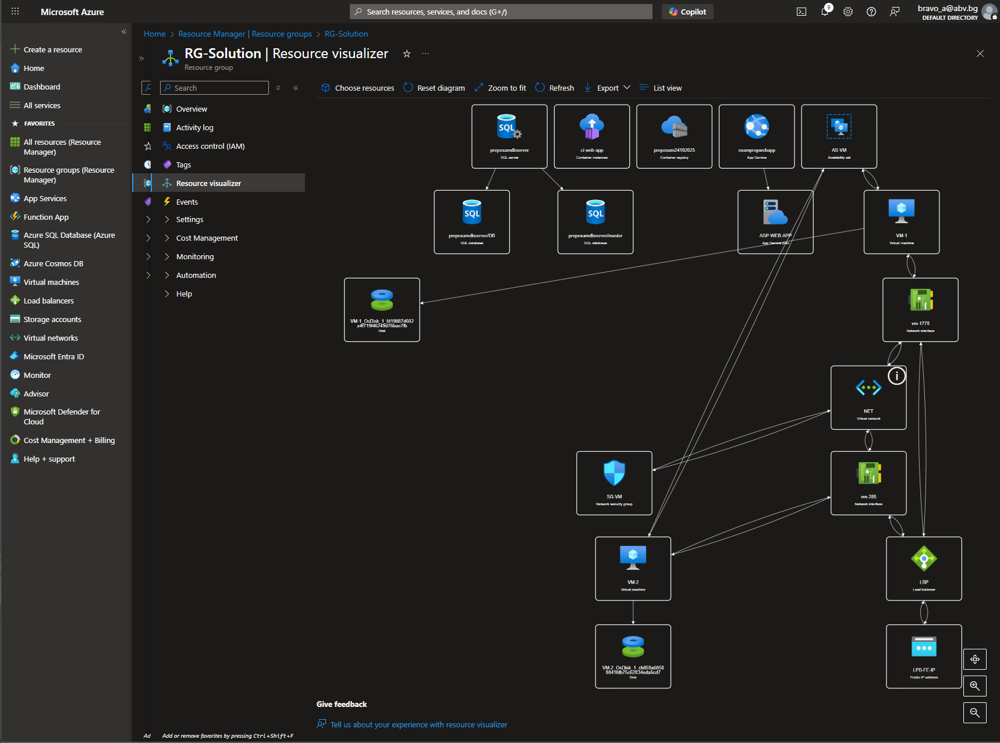

## Problem (Variant A)

You are expected to create the following set of resources:


### Tasks

#### Infrastructure - 5 tasks, 12 pts

- (T101, 1 pts) Create a resource group named **RG-Solution**

  - (**1**)

- (T102, 2 pts) Create an artifact (availability set or virtual machine
  scale set) that provides high availability for virtual machines and
  name it **AS-VM**

  - (**7**) _RG-Solution -> Create -> **Availability Set** -> set name -> **Update domains set** to 2 -> **Create**_

- (T103, 4 pts) Create a set of **two** **Ubuntu 22.04** (or newer)
  virtual machines each with a password set as an authentication method.
  If created in an availability set, name them **VM-x**, where **x** is
  a sequence number

  - (**8**) _RG-Solution -> Create -> **Virtual machine** -> set name -> **Availability options** set to **Availability set** -> select created Availability set -> Security type: Standard -> Image: Ubuntu Server 24.04 -> Size: Standard_B1s -> set user and pass -> **Public inbound ports**: None -> **Networking** -> check if Virtual network is set -> set **Public IP** to None -> **Create**_
  - (**9**) Create **VM-2**

- (T104, 3 pts) Create a container registry with **Basic** SKU
  - (**10**) _RG-Solution -> Create -> **Container Registry** -> **Create**_
- (T105, 2 pts) Enable the Admin user
  - (**11**) \_RG-Solution -> prepexam24102025 -> **Settings** -> **Access keys** -> set Admin user

#### Networking - 5 tasks, 12 pts

- (T201, 1 pts) Create a virtual network named **NET** with address
  space **10.0.0.0/16**

  - (**4**) _RG-Solution -> Create -> Virtual network -> set name -> IP addresses -> edit Subnet_ -> set name -> change Starting address to requested -> Save -> Create

  - (**5**) _RG-Solution -> NET -> Settings -> Subnets -> select created Subnet -> select created Security group -> Save_

- (T202, 2 pts) Create a subnet named **NET-SUB-VM** with address space
  **10.0.1.0/24**

- (T203, 2 pts) Create a network security group **SG-VM**, attach it to
  the **NET-SUB-VM** subnet, and create two **inbound** rules -- one to
  allow communication on port **22/tcp** and a second one to allow
  communication on port **80/tcp**

  - (**2**) _RG-Solution -> Create -> Network Security Group_
  - (**3**) _RG-Solution -> SG-VM -> Settings -> Inbound security rules -> Add -> SSH with name port_22_ -_RG-Solution -> SG-VM -> Settings -> Inbound security rules -> Add -> HTTP with name port_80_

- (T204, 5 pts) Create an external load balancer named **LBP** with the
  corresponding set of backend pool, health probe, and load balancing
  rule that maps external port **80/tcp** to internal port **80/tcp**.
  It should have public IP address

  - (**6**) _RG-Solution -> Create -> Load Balancer -> set name -> Type: Public -> Frontend IP configuration -> Add -> name LBP-FE -> Public IP address create new -> Name LBP-FE-IP -> Save -> Save -> Create_
  - (**14**) _RG-Solution -> LBP -> Settings -> Backend pools -> Add -> set name -> select created Virtual network from point **4** -> Add -> select both VMs -> **Save**_
  - (**15**) _RG-Solution -> LBP -> Settings -> Health probes -> Add -> set name -> **Save**_
  - (**16**) _RG-Solution -> LBP -> Settings -> Load balancing rules -> Add -> set name -> set **Frontend IP address**, **Backend pool**, **Port**, **Backend port** and **Health probe** -> **Save**_
  - (**22**) _RG-Solution -> LBP -> Settings -> Outbound rules -> Add -> set name (LBP-OUT for example) -> set **Frontend IP address**, **Protocols**: All, **Backend pool**, check **Enable default port allocation** -> **Save**_

- (T205, 2 pts) Create a set of NAT rules to allow connection over SSH
  to each VM
  - (**17**) _RG-Solution -> LBP -> Settings -> Inbound NAT rules -> Add -> set name -> set **Target virtual machine**, **Network IP configuration**, **Frontend IP address**, **Frontend Port** (10122 for example), **Service Tag**: Custom and **Backend port**: 22 -> **Save**_
  - (**18**) - Same rule for **VM-2**

#### Databases - 3 tasks, 7 pts

- (T301, 3 pts) Create SQL Server and a database

  - (**12**) _RG-Solution -> Create -> SQL Database -> set **Database name** -> Create **Server** -> set SQL authentication -> **Compute + storage** change to DTU Basic -> **Backup storage redundancy**: Locally-redundant -> **Networking** -> **Connectivity method**: Public endpoint -> Allow Azure services and add current client IP -> **Create**_

- (T302, 2 pts) Configure connectivity to the server

  - (**13**) - Done in point **12**

- (T303, 2 pts) Initialize the database with the help of the
  **create-structures.sql** file part of the supporting files set
  - (**19**) _RG-Solution -> **DB** (Database) -> Query editor -> login -> Run query from sql/create-structures.sql_

#### Containers and Images - 5 tasks, 10 pts

- (T401, 2 pts) Add the SQL connection string to the **config.php** file
  in the **docker/web** folder

  - (**27**) _Open `docker/web/config.php` and set PHP connection string_

- (T402, 2 pts) Build the Docker image from the **Dockerfile** that is
  in the **docker** folder

  - (**28**) _In terminal -> `docker build -t web-app .`_

- (T403, 2 pts) Tag the Docker image for the Azure Container Registry

  - (**29**) _In terminal -> `docker tag web-app prepexam24102025.azurecr.io/web-app:v1`_

- (T404, 2 pts) Publish the Docker image to the Azure Container Registry

  - (**30**) _In terminal -> `docker login prepexam24102025.azurecr.io` -> `docker push prepexam24102025.azurecr.io/web-app:v1`_

- (T405, 2 pts) Create container instance of the image and make sure
  that the app is working and showing correct results

  - (**31**) _RG-Solution -> Container instance -> set name (ci-exam-app for example) -> **Image source**: Azure Container Registry -> **Create**_

  

#### Software and App Deployment - 8 tasks, 19 pts

- (T501, 3 pts) Install **Apache + PHP** on all **VMs**
  - (**20**) _RG-Solution -> LBP -> Settings -> Frontend IP configuration -> take the AP address (**LPB-FE-IP**)_
  - (**21**) _Do ssh to VM-1 and VM-2 -> ssh -p 10122 tonytech@**LPB-FE-IP**_
  - (**23**) _Do same on both VMs -> `sudo apt update && sudo apt install -y apache2 php php-dev` -> `sudo rm /var/www/html/index.html` -> `echo '<?php phpinfo(); ?>' | sudo tee /var/www/html/index.php` -> `curl http://localhost`_
- (T502, 2 pts) Install **all supplementary software** on all **VMs** to
  allow them to communicate with the SQL Server database

  - (**24**) _Do same on both VMs -> ssh_

  ```sh
  # Download the package to configure the Microsoft repo
  curl -sSL -O https://packages.microsoft.com/config/ubuntu/$(grep VERSION_ID /etc/os-release | cut -d '"' -f 2)/packages-microsoft-prod.deb

  # Install the package
  sudo dpkg -i packages-microsoft-prod.deb

  # Delete the file
  rm packages-microsoft-prod.deb

  # Install the driver
  sudo apt-get update
  sudo ACCEPT_EULA=Y apt-get install -y msodbcsql18

  # optional: for unixODBC development headers
  sudo apt-get install -y unixodbc-dev

  # Install the PHP drivers for Microsoft SQL Server (Ubuntu)
  sudo pecl install sqlsrv
  sudo pecl install pdo_sqlsrv

  # Register mods
  sudo bash -c "echo extension=sqlsrv.so > /etc/php/8.3/mods-available/sqlsrv.ini"
  sudo bash -c "echo extension=pdo_sqlsrv.so > /etc/php/8.3/mods-available/pdo_sqlsrv.ini"

  # Enable mods
  sudo phpenmod sqlsrv pdo_sqlsrv

  # Restart Apache server
  sudo systemctl restart apache2.service
  ```

- (T503, 3 pts) Deploy and configure (add connection string) all **php
  files** (part of the supporting files set) to all VMs

  - (**25**) _Open `web-vm/config.php` and put the database connection string for PHP (RG-Solution -> DB -> Settings -> Connection strings -> PHP) -> set the password inside connection string_
  - (**26**) _In terminal -> cd to `web-vm` -> `scp -P 10122 *.php tonytech@4.231.156.132:.` -> ssh to VM -> `sudo mv *.php /var/www/html`_

- (T504, 2 pts) Have a fully working VM-based web application

  

- (T505, 3 pts) Create a PHP code-based (not container-based) web
  application (App Service) \*

  - (**32**) _RG-Solution -> Create -> Web App -> set name -> check **Region** -> **Runtime stack**: PHP 8.3 (on Ubuntu 24.04) -> **Linux Plan (North Europe)** create new -> **Pricing plan**: Basic B1 -> **Deployment** -> **Authentication settings** select Enable -> **Create**_

- (T506, 2 pts) Add the SQL connection string to the **index.php** file
  in the **webapp** folder

  - (**33**) _Open `webapp/config.php` and set PHP connection string_

  - (**34**) _Open in WinSCP or other SFTP client -> copy all the files inside `webapp` folder to remote folder_

- (T507, 2 pts) Deploy the web application code to Azure
  - (**34**) _RG-Solution -> examprepwebapp (the Web App) -> Deployment -> Deployment Center -> FTPS Credentials -> take ftps endpoint and credentials_
- (T508, 2 pts) Make sure that the web app is working and showing
  correct results

  

## Resource group -> Resource visualizer



## [Resource group -> Automation -> Export template](./ExportedTemplate-RG-Solution.zip)
