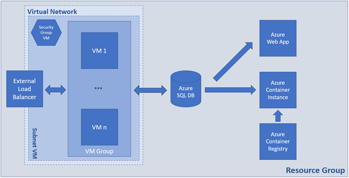

## Problem (Variant A)

You are expected to create the following set of resources:



### Tasks

#### Infrastructure - 5 tasks, 12 pts

- (T101, 1 pts) Create a resource group named **RG-Solution**

- (T102, 2 pts) Create an artifact (availability set or virtual machine
  scale set) that provides high availability for virtual machines and
  name it **AS-VM**

- (T103, 4 pts) Create a set of **two** **Ubuntu 22.04** (or newer)
  virtual machines each with a password set as an authentication method.
  If created in an availability set, name them **VM- x**, where **x** is
  a sequence number

- (T104, 3 pts) Create a container registry with **Basic** SKU

- (T105, 2 pts) Enable the Admin user

#### Networking - 5 tasks, 12 pts

- (T201, 1 pts) Create a virtual network named **NET** with address
  space **10.0.0.0/16**

- (T202, 2 pts) Create a subnet named **NET-SUB-VM** with address space
  **10.0.1.0/24**

- (T203, 2 pts) Create a network security group **SG-VM**, attach it to
  the **NET-SUB-VM** subnet, and create two **inbound** rules -- one to
  allow communication on port **22/tcp** and a second one to allow
  communication on port **80/tcp**

- (T204, 5 pts) Create an external load balancer named **LBP** with the
  corresponding set of backend pool, health probe, and load balancing
  rule that maps external port **80/tcp** to internal port **80/tcp**.
  It should have public IP address

- (T205, 2 pts) Create a set of NAT rules to allow connection over SSH
  to each VM

#### Databases - 3 tasks, 7 pts

- (T301, 3 pts) Create SQL Server and a database

- (T302, 2 pts) Configure connectivity to the server

- (T303, 2 pts) Initialize the database with the help of the
  **create-structures.sql** file part of the supporting files set

#### Containers and Images - 5 tasks, 10 pts

- (T401, 2 pts) Add the SQL connection string to the **config.php** file
  in the **docker/web** folder

- (T402, 2 pts) Build the Docker image from the **Dockerfile** that is
  in the **docker** folder

- (T403, 2 pts) Tag the Docker image for the Azure Container Registry

- (T404, 2 pts) Publish the Docker image to the Azure Container Registry

- (T405, 2 pts) Create container instance of the image and make sure
  that the app is working and showing correct results

#### Software and App Deployment - 8 tasks, 19 pts

- (T501, 3 pts) Install **Apache + PHP** on all **VMs**

- (T502, 2 pts) Install **all supplementary software** on all **VMs** to
  allow them to communicate with the SQL Server database

- (T503, 3 pts) Deploy and configure (add connection string) all **php
  files** (part of the supporting files set) to all VMs

- (T504, 2 pts) Have a fully working VM-based web application

- (T505, 3 pts) Create a PHP code-based (not container-based) web
  application (App Service) \*

- (T506, 2 pts) Add the SQL connection string to the **index.php** file
  in the **webapp** folder

- (T507, 2 pts) Deploy the web application code to Azure

- (T508, 2 pts) Make sure that the web app is working and showing
  correct results

### _Solution_

- Create a **Resource group**

```sh
az login

az group create \
--name RG-Solution \
--location northeurope
```

- Create **Network Security group**

```sh
az network nsg create \
--resource-group RG-Solution \
--name SG-VM
```

- Add inbound rule to allow HTTP (port 80)

```sh
az network nsg rule create \
--resource-group RG-Solution \
--nsg-name SG-VM \
--name allow-http \
--priority 100 \
--direction Inbound \
--access Allow \
--protocol Tcp \
--destination-port-ranges 80
```

- Add inbound rule to allow SSH (port 22)

```sh
az network nsg rule create \
--resource-group RG-Solution \
--nsg-name SG-VM \
--name allow-ssh \
--priority 101 \
--direction Inbound \
--access Allow \
--protocol Tcp \
--destination-port-ranges 22
```

- Create NAT rules on the Load Balancer for port SSH (port 2)

```sh
# NAT rule for VM-1
az network lb inbound-nat-rule create \
--resource-group RG-Solution \
--lb-name LBP \
--name LBP-NAT-VM1-SSH \
--protocol Tcp \
--frontend-port 10122 \
--backend-port 22 \
--frontend-ip-name LBP-FE

# NAT rule for VM-2
az network lb inbound-nat-rule create \
--resource-group RG-Solution \
--lb-name LBP \
--name LBP-NAT-VM2-SSH \
--protocol Tcp \
--frontend-port 10222 \
--backend-port 22 \
--frontend-ip-name LBP-FE
```

- Create Virtual Network and one subnet before creating a VMSS.

```sh
az network vnet create \
--resource-group RG-Solution \
--name NET \
--address-prefix 10.0.0.0/16 \
--subnet-name NET-SUB-VM \
--subnet-prefix 10.0.1.0/24 \
--network-security-group SG-VM
```

- Create public IP address for Load balancer frontend

```sh
az network public-ip create \
--resource-group RG-Solution \
--name LBP-IP \
--sku Standard \
--allocation-method static
```

- Create **Load Balancer**

```sh
az network lb create \
--resource-group RG-Solution \
--name LBP \
--sku Standard \
--public-ip-address LBP-IP \
--frontend-ip-name LBP-FE \
--backend-pool-name LBP-BEP
```

- Create a **Health probe** for port 80

```sh
az network lb probe create \
--resource-group RG-Solution \
--lb-name LBP \
--name LBP-HP \
--protocol Tcp \
--port 80
```

- Create **Load balancing rules** to allow frontend:80 to backend:80

```sh
az network lb rule create \
--resource-group RG-Solution \
--lb-name LBP \
--name LBP-HTTP-IN \
--protocol Tcp \
--frontend-port 80 \
--backend-port 80 \
--frontend-ip-name LBP-FE \
--backend-pool-name LBP-BEP \
--probe-name LBP-HP \
--disable-outbound-snat true
```

- Create outbound rule (if we want MVs to have access to internet)

```sh
az network lb outbound-rule create \
--resource-group RG-Solution \
--lb-name LBP \
--name LBP-OUT \
--frontend-ip-configs LBP-FE \
--address-pool LBP-BEP \
--protocol Tcp \
--idle-timeout 30
```

- Create an **Availability set**

```sh
az vm availability-set create \
--resource-group RG-Solution \
--name AS-VM \
--platform-fault-domain-count 2 \
--platform-update-domain-count 2 \
--location northeurope
```

- Create two individuals VMs and attach them to the scale set

```sh
az vm create \
--resource-group RG-Solution \
--name VM-1 \
--image Ubuntu2404 \
--size Standard_B1s \
--admin-username tonytech \
--admin-password "New_1234512345" \
--availability-set AS-VM \
--vnet-name NET \
--subnet NET-SUB-VM \
--nsg "" \
--public-ip-address "" \
--no-wait

az vm create \
--resource-group RG-Solution \
--name VM-2 \
--image Ubuntu2404 \
--size Standard_B1s \
--admin-username tonytech \
--admin-password "New_1234512345" \
--availability-set AS-VM \
--vnet-name NET \
--subnet NET-SUB-VM \
--nsg "" \
--public-ip-address "" \
--no-wait
```

- Find VMs NICs

```sh
az network nic list --resource-group RG-Solution -o table

```

- Attach Both VMs to Load Balancer Backend Pool (`LBP-BEP`)

```sh
az network nic ip-config address-pool add \
--address-pool LBP-BEP \
--ip-config-name ipconfigVM-1 \
--nic-name VM-1VMNic \
--resource-group RG-Solution \
--lb-name LBP

az network nic ip-config address-pool add \
--address-pool LBP-BEP \
--ip-config-name ipconfigVM-2 \
--nic-name VM-2VMNic \
--resource-group RG-Solution \
--lb-name LBP
```

- Associate each NAT rule with the corresponding VM’s NIC

```sh
# Attach LBP-NAT-VM1-SSH to VM-1’s NIC
az network nic ip-config inbound-nat-rule add \
--resource-group RG-Solution \
--nic-name VM-1VMNic \
--ip-config-name ipconfigVM-1 \
--lb-name LBP \
--inbound-nat-rule LBP-NAT-VM1-SSH

# Attach LBP-NAT-VM2-SSH to VM-2’s NIC
az network nic ip-config inbound-nat-rule add \
--resource-group RG-Solution \
--nic-name VM-2VMNic \
--ip-config-name ipconfigVM-2 \
--lb-name LBP \
--inbound-nat-rule LBP-NAT-VM2-SSH
```

- Take LBP IP address

```sh
az network public-ip show \
--resource-group RG-Solution \
--name LBP-IP \
--query ipAddress \
-o tsv

20.223.168.254
```

- Check the access to both VMs

```sh
ssh -p 10122 tonytech@20.223.168.254
ssh -p 10222 tonytech@20.223.168.254
```

- Create **SQL Server**

```sh
az sql server create \
--resource-group RG-Solution \
--name exam-sql-server \
--location northeurope \
--admin-user tonytech \
--admin-password "New_1234512345"
```

- Create **Database** (DTU model → Basic tier, locally redundant backups)

```sh
az sql db create \
--resource-group RG-Solution \
--server exam-sql-server \
--name DB \
--edition Basic \
--backup-storage-redundancy Local
```

- Allow Azure services

```sh
az sql server firewall-rule create \
--resource-group RG-Solution \
--server exam-sql-server \
--name AllowAzureServices \
--start-ip-address 0.0.0.0 \
--end-ip-address 0.0.0.0
```

- Allow your current client IP

```sh
az sql server firewall-rule create \
--resource-group RG-Solution \
--server exam-sql-server \
--name AllowClientIP \
--start-ip-address $(curl -s ifconfig.me) \
--end-ip-address $(curl -s ifconfig.me)
```

- Initialize the database with the help of the create-structures.sql

```sh
sqlcmd -S exam-sql-server.database.windows.net \
       -d DB \
       -U tonytech \
       -P "New_1234512345" \
       -C \
       -i sql/create-structures.sql
```

- On both VMs install Apache and PHP

```sh
# Install Apache and PHP
sudo apt update && sudo apt install -y apache2 php php-dev

# Remove default index.html file
sudo rm /var/www/html/index.html

# Set simple php code to test PHP installation
echo '<?php phpinfo(); ?>' | sudo tee /var/www/html/index.php

# Test
curl http://localhost
```

- Install all supplementary software on all VMs to allow them to communicate with the SQL Server database

```sh
# Download the package to configure the Microsoft repo
curl -sSL -O https://packages.microsoft.com/config/ubuntu/$(grep VERSION_ID /etc/os-release | cut -d '"' -f 2)/packages-microsoft-prod.deb

# Install the package
sudo dpkg -i packages-microsoft-prod.deb

# Delete the file
rm packages-microsoft-prod.deb

# Install the driver
sudo apt-get update
sudo ACCEPT_EULA=Y apt-get install -y msodbcsql18

# optional: for unixODBC development headers
sudo apt-get install -y unixodbc-dev

# Install the PHP drivers for Microsoft SQL Server (Ubuntu)
sudo pecl install sqlsrv
sudo pecl install pdo_sqlsrv

# Register mods
sudo bash -c "echo extension=sqlsrv.so > /etc/php/8.3/mods-available/sqlsrv.ini"
sudo bash -c "echo extension=pdo_sqlsrv.so > /etc/php/8.3/mods-available/pdo_sqlsrv.ini"

# Enable mods
sudo phpenmod sqlsrv pdo_sqlsrv

# Restart Apache server
sudo systemctl restart apache2.service
```

- Deploy and configure (add connection string) all php files (part of the supporting files set) to all VMs

```sh
# web-vm/config.php and put the database connection string for PHP (RG-Solution -> DB -> Settings -> Connection strings -> PHP) -> set the password inside connection string

# Navigate to web-vm folder
scp -P 10122 *.php tonytech@20.223.168.254:.
scp -P 10122 *.php tonytech@20.223.168.254:.

# SSH to VMs and execute
sudo mv *.php /var/www/html
```

- Have a fully working VM-based web application


