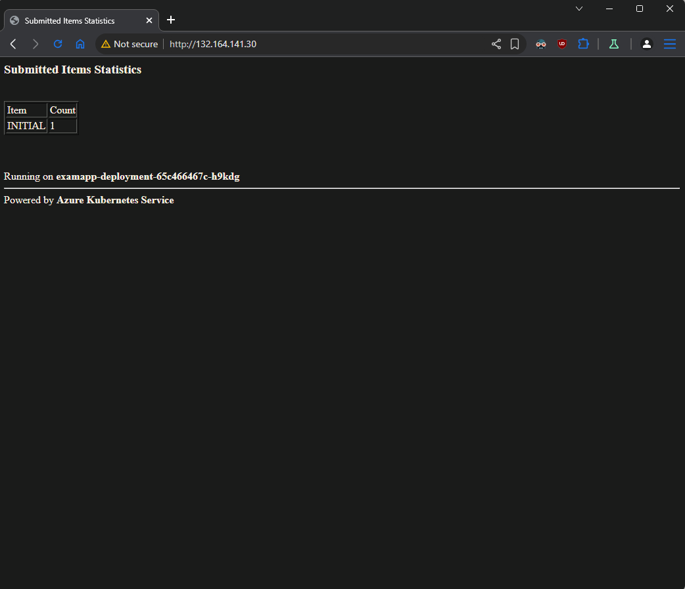
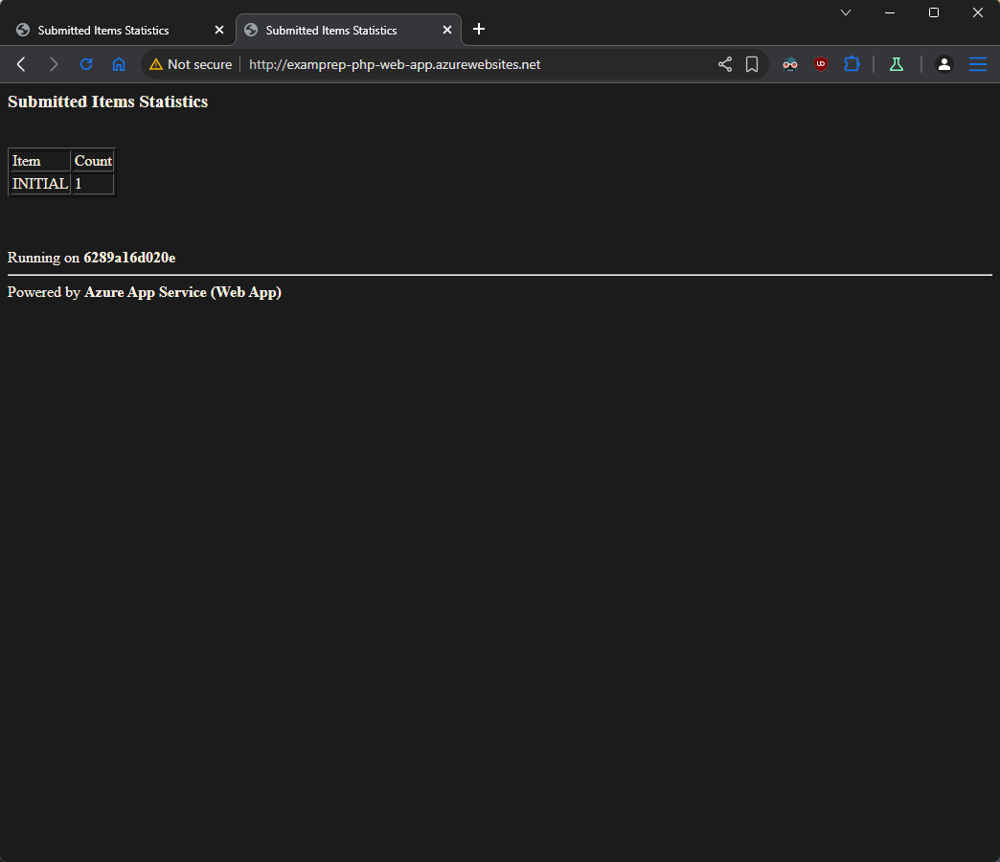
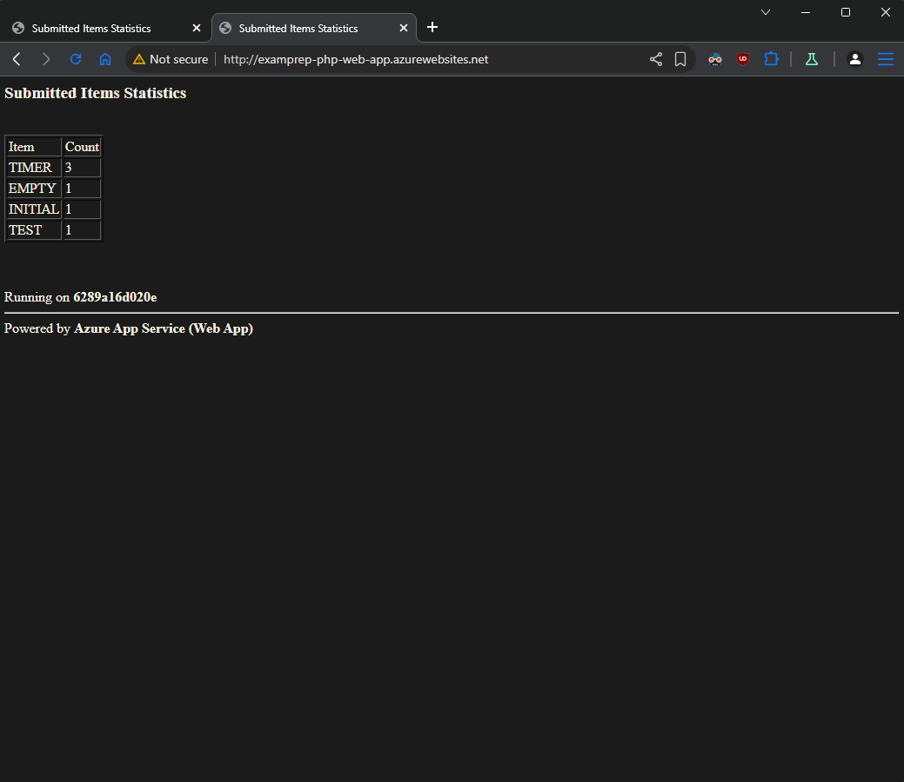

## Problem (Variant B)

You are expected to create the following set of resources:


### Tasks

#### Infrastructure - 5 tasks, 14 pts

- (T101, 1 pts) Create a resource group named **RG-SolutionB**

- (T102, 3 pts) Create a container registry with **Basic** SKU

- (T103, 2 pts) Enable the Admin user

- (T104, 6 pts) Create an Azure Kubernetes Service resource with **one
  node** of size **B2s**

- (T105, 2 pts) **Link** the ACR to the AKS

#### Containers and Images - 7 tasks, 17 pts

- (T201, 2 pts) Add the SQL connection string to the **index.php** file
  in the **docker/web** folder

- (T202, 2 pts) Build the Docker image from the **Dockerfile** that is
  in the **docker** folder

- (T203, 2 pts) Tag the Docker image for the Azure Container Registry

- (T204, 2 pts) Publish the Docker image to the Azure Container Registry

- (T205, 3 pts) Adjust the **deployment.yaml** file in the **manifests**
  folder to point to the published Docker image

- (T206, 3 pts) Publish the manifests to the Kubernetes cluster (Azure
  Kubernetes Service)

- (T207, 3 pts) Make sure that the app is working and showing correct
  results

#### Databases - 3 tasks, 7 pts

- (T301, 3 pts) Create SQL Server and a database

- (T302, 2 pts) Configure connectivity to the server

- (T303, 2 pts) Initialize the database with the help of the
  **create-structures.sql** file part of the supporting files set

#### Web Apps and Functions - 8 tasks, 22 pts

- (T401, 3 pts) Create a PHP code-based (not container-based) web
  application (App Service) \*

- (T402, 2 pts) Add the SQL connection string to the **index.php** file
  in the **webapp** folder

- (T403, 2 pts) Deploy the web application code to Azure

- (T404, 2 pts) Make sure that the web app is working and showing
  correct results

- (T405, 3 pts) Create a code-based **Function App** with **.NET Core**
  as runtime \*

- (T406, 3 pts) Create a **Timer triggered** function. It must execute
  **every two minutes** and insert a row with **SubmittedName=TIMER** in
  the database (table **SubmittedItems**)

- (T407, 5 pts) Create an HTTP **triggered** function. When executed it
  must accept a single parameter (**name**) and store the value in the
  database (table **SubmittedItems**). If, however, executed without
  one, it should store an item with the label **EMPTY**

- (T408, 2 pts) Make sure that you have executed the HTTP triggered
  function successfully several times with various values for the
  parameter. For example, **EXAM**, **TEST**, etc.

_\* Note that you may need to create an additional resource group(s)_

## Clean up

Don't forget to stop and delete all resources that you won't need

You can delete a resource group with all referenced resources directly

If you have any doubts, visit the **All resources** option in **Azure
Portal** to check if there are any unnecessary resources left and delete
them manually

### _Solution_

- Create a resource group named **RG-SolutionB**

```sh
az login

az group create \
--name RG-SolutionB \
--location northeurope
```

- Create a **Container registry** with **Basic** SKU and enable the Admin user

```sh
az acr create \
--resource-group RG-SolutionB \
--name examprepcr \
--sku Basic \
--admin-enabled true \
--public-network-enabled true
```

- Create an **Azure Kubernetes Service** resource with **one node** of size **B2s**

```sh
az aks create \
--resource-group RG-SolutionB \
--name exam-k8s \
--location northeurope \
--node-count 1 \
--node-vm-size Standard_L2as_v4 \
--nodepool-name agentpool \
--os-sku Ubuntu \
--zones 1 2 3 \
--kubernetes-version 1.32.7 \
--enable-managed-identity \
--generate-ssh-keys \
--attach-acr examprepcr \
--tier free
```

- Create **SQL Server**

```sh
az sql server create \
--resource-group RG-SolutionB \
--name examprep-sql-server \
--location northeurope \
--admin-user tonytech \
--admin-password "New_1234512345"
```

- Create **Database** (**DTU** model → **Basic** tier, locally redundant backups)

```sh
az sql db create \
--resource-group RG-SolutionB \
--server examprep-sql-server \
--name DB \
--edition Basic \
--backup-storage-redundancy Local
```

- Allow Azure services

```sh
az sql server firewall-rule create \
--resource-group RG-SolutionB \
--server examprep-sql-server \
--name AllowAzureServices \
--start-ip-address 0.0.0.0 \
--end-ip-address 0.0.0.0
```

- Allow your current client IP

```sh
az sql server firewall-rule create \
--resource-group RG-SolutionB \
--server examprep-sql-server \
--name AllowClientIP \
--start-ip-address $(curl -s ifconfig.me) \
--end-ip-address $(curl -s ifconfig.me)
```

- Initialize the database with the help of the `sql\create-structures.sql` file part of the supporting files set

```sh
sqlcmd -S examprep-sql-server.database.windows.net \
       -d DB \
       -U tonytech \
       -P "New_1234512345" \
       -C \
       -i sql/create-structures.sql
```

- Add the SQL connection string to the `docker/web/index.php` file
- Build Docker image from **Dockerfile** inside `docker` folder

```sh
docker build . -t php-app
```

- Tag the Docker image for the **Azure Container Registry**

```sh
docker tag php-app examprepcr.azurecr.io/php-app:v1
```

- Login to just created **Azure Container registry**

```sh
az acr login --name examprepcr
```

- Push the image to remote registry

```sh
docker push examprepcr.azurecr.io/php-app:v1
```

- Adjust the `manifests/deployment.yaml` file to point to the published Docker image

- Download cluster credentials (Resource group -> k8s cluster -> Connect)

```sh
az aks get-credentials --resource-group RG-SolutionB --name exam-k8s --overwrite-existing
```

- Publish the manifests to the Kubernetes cluster (Azure Kubernetes Service)

```sh
kubectl apply -f deployment.yaml -f service.yaml
```

- Make sure that the app is working and showing correct results



- Create **App Service plan**

```sh
az appservice plan create \
--name asp-exam \
--resource-group RG-SolutionB \
--location northeurope \
--sku B1 \
--is-linux
```

- Create **Web App**

```sh
az webapp create \
--resource-group RG-SolutionB \
--plan asp-exam \
--name examprep-php-web-app \
--runtime "PHP|8.3" \
--basic-auth Enabled
```

- Take **SFTP** settings for connection

```sh
az webapp deployment list-publishing-profiles \
--name examprep-php-web-app \
--resource-group RG-SolutionB \
--query "[?publishMethod=='FTP'].[publishUrl,userName,userPWD]" \
--output tsv
```

- Add the SQL connection string to the `webapp\index.php` file
- Deploy the files inside `webapp` folder with SFTP client to **Web App** server
- Make sure that the web app is working and showing correct results



- Create a code-based **Function App** with **.NET Core** as runtime

> Go to **Resource group** -> Create -> **Function App** -> Consumption -> set name: examprepfa -> Runtime stack: **_.NET_** -> Version: **_8(LTS), in-process model_** -> Region: **_North Europe_** -> **Deployment -> Basic authentication: \***Enable\*\*\*

- Take Connection string for **ADO.NET (SQL authentication)**

- Create new **Connection string** in **Function App**

> Go to **Function App** -> Settings -> Environment variables -> Connection strings -> Add -> Name: **_ConnectionString_** -> Value: **_SQL connection string from above_** -> Type: **_SQLAzure_**

- Create a Timer triggered function. It must execute every two minutes and insert a row with SubmittedName=TIMER in the database (table SubmittedItems)

> Go to **Function App** -> **Create function** -> Select a template: _Timer trigger_ -> Function name: _time_trigger_func_ -> Schedule: _0 */2 * \* \* \*_

> Integration -> **Outputs** -> Add output -> Binding Type: _Azure SQL Output Binding_ -> Name: _**submittedItem**_ -> Table Name: _**SubmittedItems**_ -> SQL Connection string setting -> _ConnectionString_ -> Add

- Paste code in **Code + Test**

  ```csharp
  #r "Newtonsoft.Json"

  using System.Net;
  using Microsoft.AspNetCore.Mvc;
  using Microsoft.Extensions.Primitives;
  using Newtonsoft.Json;

  public class SubmittedItem
  {
    public string SubmittedName { get; set; }
  }

  public static void Run(TimerInfo myTimer, ILogger log, out SubmittedItem submittedItem)
  {
    log.LogInformation($"C# Timer trigger function executed at: {DateTime.Now}");
    submittedItem = new SubmittedItem();
    submittedItem.SubmittedName = "TIMER";
  }
  ```

- Create an HTTP triggered function. When executed it must accept a single parameter (name) and store the value in the database (table SubmittedItems). If, however, executed without one, it should store an item with the label EMPTY

> Go to **Function App** -> **Create function** -> Select a template: _HTTP Trigger_ -> Function name: **_http_trigger_func_** -> Authorization level: **_Function_** -> Create

> Integration -> **Outputs** -> Add output -> Binding Type: _Azure SQL Output Binding_ -> Name: _**submittedItem**_ -> Table Name: _**SubmittedItems**_ -> SQL Connection string setting -> _ConnectionString_ -> Add

- Paste code in **Code + Test**

```csharp
#r "Newtonsoft.Json"

using System.Net;
using Microsoft.AspNetCore.Mvc;
using Microsoft.Extensions.Primitives;
using Microsoft.Extensions.Logging;
using Newtonsoft.Json;

public class SubmittedItem
{
    public string SubmittedName { get; set; }
}

public static IActionResult Run(HttpRequest req, ILogger log, out SubmittedItem submittedItem)
{
    log.LogInformation("C# HTTP trigger function processed a request.");

    string name = req.Query["name"];

    submittedItem = new SubmittedItem();
    submittedItem.SubmittedName = string.IsNullOrEmpty(name) ? "EMPTY" : name;

    string responseMessage = string.IsNullOrEmpty(name)
        ? "This HTTP triggered function executed successfully. Pass a name in the query string."
        : $"This HTTP triggered function executed successfully. It was called with name={name}.";

    return new OkObjectResult(responseMessage);
}
```

- Make sure that you have executed the HTTP triggered function successfully several times with various values for the parameter. For example, EXAM, TEST, etc.



- Delete Resource group

```sh
az group delete \
--name RG-SolutionB \
--yes \
--no-wait
```
