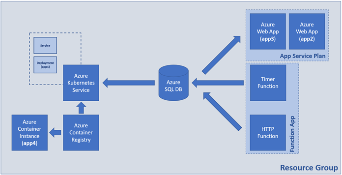

# **Exam: AzE 2025.09 – 26.10.2025 (Variant B)**

## **Rules**

- Be sure to follow exactly the **IP addresses**, **resource names, file names, etc.** as requested in the tasks
- Tasks execution order should not be derived from the order in which they are listed below
- Тhere are tasks that depend on the successful completion of one or more other tasks
- All resources are expected to be in **one region** (of your choice). If you deviate from this, state the reason(s)
- If not stated explicitly, use the smallest and cheapest possible resource option that will do the job
- Feel free to set up public IP addresses or other options to virtual machines or other resources for debugging purposes
- **The aim is** not to build a production-ready solution but a **working one**

**_NOTE: This document has 3 pages. Make sure you read all of them_**

## **Goal**

You are expected to create the following set of resources:

### **Tasks**

#### **Infrastructure and Organization - 12 pts**

- (T101, 1 pts) Create a resource group named **RG-SolutionB**
- (T102, 2 pts) Create a container registry with **Basic** SKU
- (T103, 1 pts) Enable the **Admin** user in the registry
- (T104, 5 pts) Create an Azure Kubernetes Service resource with **one node** of smallest size you see fit
- (T105, 1 pts) **Link** the ACR to the AKS
- (T106, 1 pts) Add a tag **purpose** with value **exam** on the container registry
- (T107, 1 pts) Add a **CanNotDelete** (**Delete**) lock on the container registry and name it **Exam-Lock**

#### **Containers and Images - 16 pts**

##### **Azure Kubernetes Service**

- (T201, 1 pts) Add the SQL connection string to the **index.php** file in the **app1/web** folder
- (T202, 1 pts) Build the container image from the **Dockerfile** that is in the **app1** folder
- (T203, 1 pts) Tag the container image for the Azure Container Registry
- (T204, 1 pts) Publish the container image to the Azure Container Registry
- (T205, 1 pts) Adjust the **deployment.yaml** file in the **app1/manifests** folder to point to the published image
- (T206, 2 pts) Publish the manifests to the Kubernetes cluster (Azure Kubernetes Service)
- (T207, 2 pts) Make sure that the app is working and showing correct results

##### **Azure Container Instance**

- (T208, 1 pts) Build the container image from the **Dockerfile** that is in the **app4** folder
- (T209, 1 pts) Tag the container image for the Azure Container Registry
- (T210, 1 pts) Publish the container image to the Azure Container Registry
- (T211, 2 pts) Create container instance out of the image
- (T212, 2 pts) Make sure that the app is working and showing correct results

#### **Databases - 6 pts**

- (T301, 3 pts) Create SQL Server and a database
- (T302, 2 pts) Configure connectivity to the server
- (T303, 1 pts) Initialize the database from the **db/create-structures.sql** file

#### **Web Apps - 12 pts**

- (T401, 2 pts) Create a Linux-based App Service Plan, name it **ASP-LINUX**, and select either **F1** or **B1** pricing plan
- (T402, 1 pts) Create a **PHP** code-based web application utilizing the existing service plan
  - (T402.1, 1 pts) Make sure the **basic authentication** is enabled
  - (T402.2, 1 pts) Deploy the web application (**app2**) code to Azure
  - (T402.3, 1 pts) Make sure that the web app is working and showing correct results
- (T403, 1 pts) Create a **PHP** code-based web application utilizing the existing service plan
  - (T403.1, 1 pts) Make sure the **basic authentication** is enabled
  - (T403.2, 1 pts) Add the SQL connection string to the **index.php** file in the **app3** folder
  - (T403.3, 1 pts) Deploy the web application (**app3**) code to Azure
  - (T403.4, 2 pts) Make sure that the web app is working and showing correct results

#### **Functions - 14 pts**

- (T501, 1 pts) Create a code-based **Function App** with **.NET 8 (LTS) in-process model** as runtime
- (T502, 1 pts) Create an application setting/variable that holds the connection string for the database
- (T503, 1 pts) Create a **Timer triggered** function, named **ExamTimerTrigger** that:
  - (T503.1, 1 pts) executes **every two minutes**
  - (T503.2, 2 pts) inserts a row with **SubmittedName=TIMER** in the database (table **SubmittedItems**)
  - (T503.3, 1 pts) ensure that the function is working by exploring the logs and the database
- (T504, 1 pts) Create an **HTTP triggered** function, named **ExamHTTPTrigger** that:
  - (T504.1, 2 pts) when executed it must accept a single parameter (**item**) and** store its value in the database (table **SubmittedItems\*\*).
  - (T504.2, 2 pts) if executed without parameter, it should store an item with the label **EMPTY**
  - (T504.3, 1 pts) execute the function at least once without parameter, and at least once with **item=EXAM**
  - (T504.4, 1 pts) ensure that the function is working by exploring the logs and the database

## **Proof**

Prepare a short document that describes clearly and concisely all the significant steps that led to your solution

It is **mandatory** to include **pictures of the working applications** (each one of them)

It is **mandatory** to include an **exported visualization of the solution**. Go to the **Resource group** > **Resource visualizer**, click the **Export** button and select the **High** or **Best quality** option for the format you want. Note that you may need to click the **Refresh** button first, and then the **Zoom to fit** button

It is **mandatory** to include an **exported template of the solution**. Go to the **Resource group** > **Automation** > **Export template** and click the **Download** button

Feel free to include additional information, pictures, and any supporting files

## **Clean up**

Once you are done and you upload the solution, don’t forget to delete (mind the locks) all resources that you won’t need
