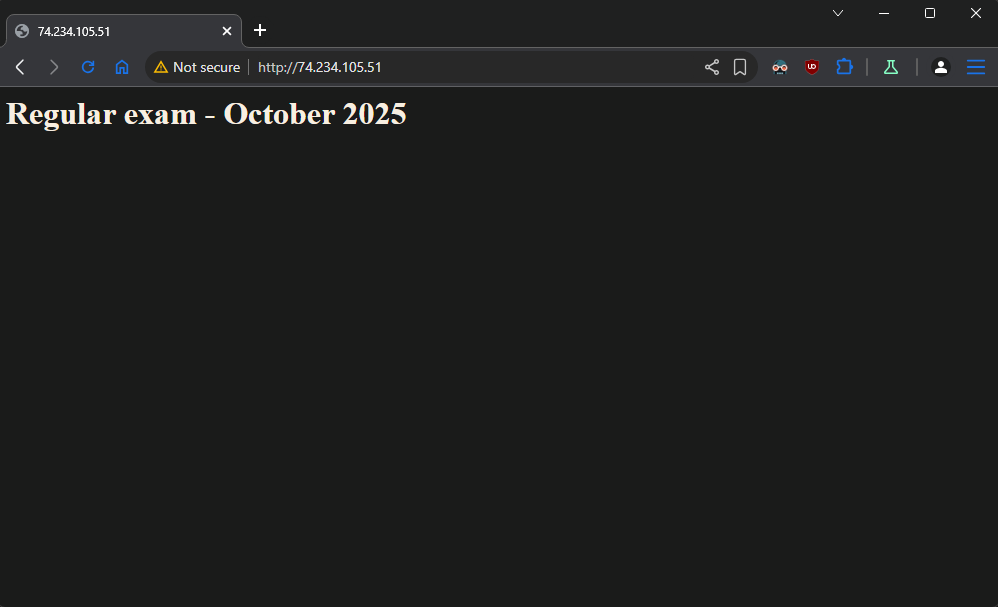
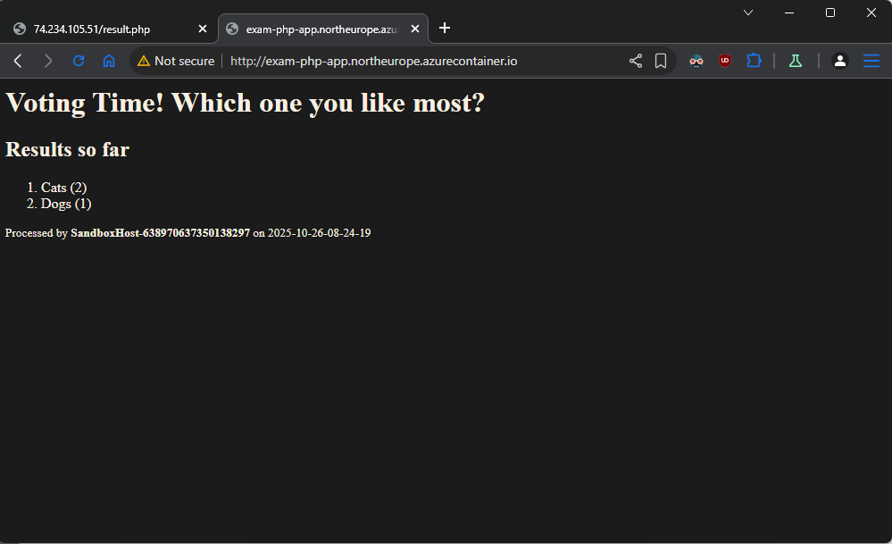
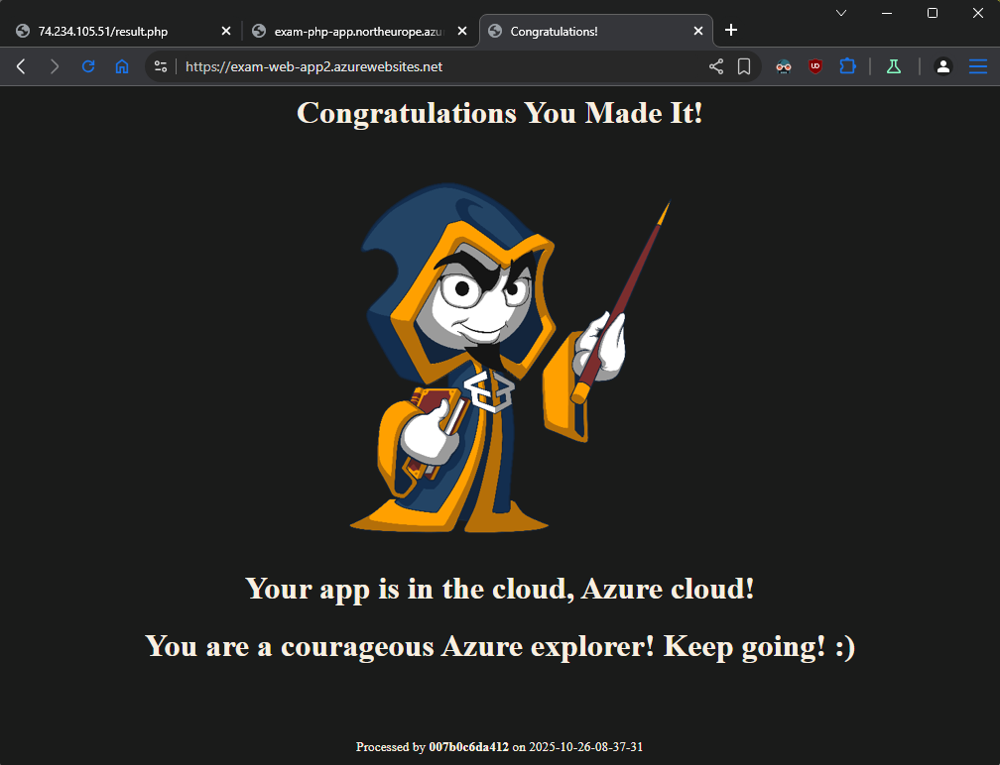

## Solution - Variant A

- Create a resource group named **RG-SolutionA**

```sh
az login

az group create \
--name RG-SolutionA \
--location northeurope
```

- Create a network security group **SG-VM**

```sh
az network nsg create \
--resource-group RG-SolutionA \
--name SG-VM
```

- Add **inbound** rule to allow communication on port **22/tcp** named **Rule-SSH**

```sh
az network nsg rule create \
--resource-group RG-SolutionA \
--nsg-name SG-VM \
--name Rule-SSH \
--priority 100 \
--direction Inbound \
--access Allow \
--protocol Tcp \
--destination-port-ranges 22
```

- Add **inbound** rule to allow communication on port **80/tcp** named **Rule-HTTP**

```sh
az network nsg rule create \
--resource-group RG-SolutionA \
--nsg-name SG-VM \
--name Rule-HTTP \
--priority 101 \
--direction Inbound \
--access Allow \
--protocol Tcp \
--destination-port-ranges 80
```

- Create a virtual network named **NET** with address space **10.0.0.0/16** and Create a subnet named **NET-SUB-VM** with address space **10.0.1.0/24**

```sh
az network vnet create \
--resource-group RG-SolutionA \
--name NET \
--address-prefix 10.0.0.0/16 \
--subnet-name NET-SUB-VM \
--subnet-prefix 10.0.1.0/24 \
--network-security-group SG-VM
```

- Create public IP address for **Load balancer** frontend

```sh
az network public-ip create \
--resource-group RG-SolutionA \
--name LBP-IP \
--sku Standard \
--allocation-method static
```

- Create an external **Load Balancer** named **LBP**

```sh
az network lb create \
--resource-group RG-SolutionA \
--name LBP \
--sku Standard \
--public-ip-address LBP-IP \
--frontend-ip-name LBP-FE \
--backend-pool-name LBP-BEP
```

- Create a **Health probe** probe named **LBP-HP**

```sh
az network lb probe create \
--resource-group RG-SolutionA \
--lb-name LBP \
--name LBP-HP \
--protocol Tcp \
--port 80
```

- Create a load balancing rule, named **LBP-RULE**, that maps **external** port 80/tcp to **internal** port 80/tcp

```sh
az network lb rule create \
--resource-group RG-SolutionA \
--lb-name LBP \
--name LBP-RULE \
--protocol Tcp \
--frontend-port 80 \
--backend-port 80 \
--frontend-ip-name LBP-FE \
--backend-pool-name LBP-BEP \
--probe-name LBP-HP \
--disable-outbound-snat true
```

- Add a set of NAT rules to the load balancer to allow connection over SSH to each VM and name them **LBP-NAT-SSH-1** and **LBP-NAT-SSH-2**

```sh
# NAT rule for VM-1
az network lb inbound-nat-rule create \
--resource-group RG-SolutionA \
--lb-name LBP \
--name LBP-NAT-SSH-1 \
--protocol Tcp \
--frontend-port 10122 \
--backend-port 22 \
--frontend-ip-name LBP-FE

# NAT rule for VM-2
az network lb inbound-nat-rule create \
--resource-group RG-SolutionA \
--lb-name LBP \
--name LBP-NAT-SSH-2 \
--protocol Tcp \
--frontend-port 10222 \
--backend-port 22 \
--frontend-ip-name LBP-FE
```

- Create an outbound rule **LBP-OUT**

```sh
az network lb outbound-rule create \
--resource-group RG-SolutionA \
--lb-name LBP \
--name LBP-OUT \
--frontend-ip-configs LBP-FE \
--address-pool LBP-BEP \
--protocol Tcp \
--idle-timeout 30
```

- Create an aligned **Availability set** and name it **AS-VM**

```sh
az vm availability-set create \
--resource-group RG-SolutionA \
--name AS-VM \
--platform-fault-domain-count 2 \
--platform-update-domain-count 2 \
--location northeurope
```

- Create a set of **two Ubuntu 22.04** (or newer) virtual machines, each with a password set as an authentication method. Name them **VM-x**, where **x** is the sequence number

```sh
# VM-1
az vm create \
--resource-group RG-SolutionA \
--name VM-1 \
--image Ubuntu2404 \
--size Standard_B1s \
--admin-username tonytech \
--admin-password "New_1234512345" \
--availability-set AS-VM \
--vnet-name NET \
--subnet NET-SUB-VM \
--nsg "" \
--public-ip-address "" \
--no-wait

# VM-2
az vm create \
--resource-group RG-SolutionA \
--name VM-2 \
--image Ubuntu2404 \
--size Standard_B1s \
--admin-username tonytech \
--admin-password "New_1234512345" \
--availability-set AS-VM \
--vnet-name NET \
--subnet NET-SUB-VM \
--nsg "" \
--public-ip-address "" \
--no-wait
```

- Find MVs **NICs**

```sh
az network nic list --resource-group RG-SolutionA -o table
```

- Attach Both VMs to Load Balancer Backend Pool (**LBP-BEP**)

```sh
# Add VM-1
az network nic ip-config address-pool add \
--address-pool LBP-BEP \
--ip-config-name ipconfigVM-1 \
--nic-name VM-1VMNic \
--resource-group RG-SolutionA \
--lb-name LBP

# Add VM-2
az network nic ip-config address-pool add \
--address-pool LBP-BEP \
--ip-config-name ipconfigVM-2 \
--nic-name VM-2VMNic \
--resource-group RG-SolutionA \
--lb-name LBP
```

- Associate each NAT rule allowing connection over SSH with the corresponding VM’s NIC

```sh
# Attach LBP-NAT-SSH-1 to VM-1’s NIC
az network nic ip-config inbound-nat-rule add \
--resource-group RG-SolutionA \
--nic-name VM-1VMNic \
--ip-config-name ipconfigVM-1 \
--lb-name LBP \
--inbound-nat-rule LBP-NAT-SSH-1

# Attach LBP-NAT-SSH-2 to VM-2’s NIC
az network nic ip-config inbound-nat-rule add \
--resource-group RG-SolutionA \
--nic-name VM-2VMNic \
--ip-config-name ipconfigVM-2 \
--lb-name LBP \
--inbound-nat-rule LBP-NAT-SSH-2
```

- Take Load Balancer (**LBP**) public IP address

```sh
az network public-ip show \
--resource-group RG-SolutionA \
--name LBP-IP \
--query ipAddress \
-o tsv

74.234.105.51
```

- Check the SSH access to both VMs

```sh
ssh -p 10122 tonytech@74.234.105.51
ssh -p 10222 tonytech@74.234.105.51
```

- Create **SQL Server**

```sh
az sql server create \
--resource-group RG-SolutionA \
--name exam-sql-server \
--location northeurope \
--admin-user tonytech \
--admin-password "New_1234512345"
```

- Create **Database**

```sh
az sql db create \
--resource-group RG-SolutionA \
--server exam-sql-server \
--name DB \
--edition Basic \
--backup-storage-redundancy Local
```

- Configure connectivity to the **SQL server**

```sh
# Allow Azure services to access the server
az sql server firewall-rule create \
--resource-group RG-SolutionA \
--server exam-sql-server \
--name AllowAzureServices \
--start-ip-address 0.0.0.0 \
--end-ip-address 0.0.0.0

# Allow current client IP to access the server
az sql server firewall-rule create \
--resource-group RG-SolutionA \
--server exam-sql-server \
--name AllowClientIP \
--start-ip-address $(curl -s ifconfig.me) \
--end-ip-address $(curl -s ifconfig.me)
```

- Initialize the database from the `db/create-structures.sql` file

```sh
sqlcmd -S exam-sql-server.database.windows.net \
       -d DB \
       -U tonytech \
       -P "New_1234512345" \
       -C \
       -i variant-a/db/create-structures.sql
```

- Install **Apache** + **PHP** on the VMs

```sh
# Install Apache and PHP
sudo apt update && sudo apt install -y apache2 php php-dev

# Set simple html for test purpose
echo '<h1>Regular exam - October 2025</h1>' | sudo tee /var/www/html/index.html

# Test
curl http://localhost
```



- Install the required software on the VMs that will allow them to work with the SQL Server database

```sh
# Download the package to configure the Microsoft repo
curl -sSL -O https://packages.microsoft.com/config/ubuntu/$(grep VERSION_ID /etc/os-release | cut -d '"' -f 2)/packages-microsoft-prod.deb

# Install the package
sudo dpkg -i packages-microsoft-prod.deb

# Delete the file
rm packages-microsoft-prod.deb

# Install the driver
sudo apt-get update
sudo ACCEPT_EULA=Y apt-get install -y msodbcsql18

# optional: for unixODBC development headers
sudo apt-get install -y unixodbc-dev

# Install the PHP drivers for Microsoft SQL Server (Ubuntu)
sudo pecl install sqlsrv
sudo pecl install pdo_sqlsrv

# Register mods
sudo bash -c "echo extension=sqlsrv.so > /etc/php/8.3/mods-available/sqlsrv.ini"
sudo bash -c "echo extension=pdo_sqlsrv.so > /etc/php/8.3/mods-available/pdo_sqlsrv.ini"

# Enable mods
sudo phpenmod sqlsrv pdo_sqlsrv

# Restart Apache server
sudo systemctl restart apache2.service

# Check Apache service
sudo systemctl status apache2.service
```

- Add the SQL connection string to the `variant-a/app1/config.php` file

  > Take the PHP connection string form: **Resource group** -> **Database** -> **Settings** -> **Connection strings** -> **PHP** tab

- Deploy the application (**app1**) to the VMs

```sh
# Navigate to app1 folder
scp -P 10122 *.php tonytech@74.234.105.51:.
scp -P 10122 *.php tonytech@74.234.105.51:.

# SSH to VMs and execute
sudo mv *.php /var/www/html

# Remove custom index.html file
sudo rm /var/www/html/index.html

# Restart Apache server
sudo systemctl restart apache2.service
```

- Have a fully working VM-based web application reachable via the load balancer


- Create a **Container registry** with Basic SKU. Add a tag **purpose** with value **exam**.

```sh
az acr create \
--resource-group RG-SolutionA \
--name examprepcr \
--sku Basic \
--admin-enabled true \
--public-network-enabled true \
--tags purpose=exam
```

- Add a **CanNotDelete (Delete)** lock on the container registry and name it **Exam-Lock**

```sh
az lock create \
--name Exam-Lock \
--lock-type CanNotDelete \
--resource-group RG-SolutionA \
--resource-name examprepcr \
--resource-type "Microsoft.ContainerRegistry/registries"
```

- Login to just created Container registry

```sh
az acr login --name examprepcr
```

- Add SQL connection string to the `variant-a/app4/web/config.php` file
- Build Docker image from **Dockerfile** inside `app4` folder

```sh
docker build . -t php-app
```

- Tag the container image for the Azure Container Registry

```sh
docker tag php-app examprepcr.azurecr.io/php-app:v1
```

- Publish the container image to the Azure Container Registry

```sh
docker push examprepcr.azurecr.io/php-app:v1
```

- Take **Azure Container registry** password

```sh
export ACR_PASSWORD="$(az acr credential show --name examprepcr --query 'passwords[0].value' -o tsv | tr -d '\r\n')"
```

- Create container from our image `examprepcr.azurecr.io/php-app:v1`

```sh
az container create \
--resource-group RG-SolutionA \
--name exam-container \
--image examprepcr.azurecr.io/php-app:v1 \
--dns-name-label exam-php-app \
--ports 80 \
--os-type linux \
--cpu 1 \
--memory 1.5 \
--location northeurope \
--registry-login-server examprepcr.azurecr.io \
--registry-username examprepcr \
--registry-password "$ACR_PASSWORD"
```

- Take **FQDN** of container

```sh
az container show -g RG-SolutionA -n exam-container --query "{FQDN:ipAddress.fqdn}"
{
  "FQDN": "exam-php-app.northeurope.azurecontainer.io"
}
```

- Make sure that the app is working and showing correct results



- Create a Linux-based App Service Plan, name it **ASP-LINUX**, and select either **F1** or **B1** pricing plan

```sh
az appservice plan create \
--name asp-exam \
--resource-group RG-SolutionA \
--location northeurope \
--sku B1 \
--is-linux
```

- Create a PHP code-based web application utilizing the existing service plan for **app2**

```sh
az webapp create \
--resource-group RG-SolutionA \
--plan asp-exam \
--name exam-web-app2 \
--runtime "PHP|8.3" \
--basic-auth Enabled
```

- Take SFTP settings for connection to **app2**

```sh
az webapp deployment list-publishing-profiles \
--name exam-web-app2 \
--resource-group RG-SolutionA \
--query "[?publishMethod=='FTP'].[publishUrl,userName,userPWD]" \
--output tsv
```

- Deploy the files inside `variant-a/app2` with SFTP client to Web App server with name `exam-web-app2`

- Take FQDN of `exam-web-app2`

```sh
az webapp show \
--name exam-web-app2 \
--resource-group RG-SolutionA \
--query defaultHostName \
-o tsv

exam-web-app2.azurewebsites.net
```

- Make sure that the web app is working and showing correct results



- Create a PHP code-based web application utilizing the existing service plan for **app3**

```sh
az webapp create \
--resource-group RG-SolutionA \
--plan asp-exam \
--name exam-web-app3 \
--runtime "PHP|8.3" \
--basic-auth Enabled
```

- Add the SQL connection string to the `variant-a\app3\index.php` file

Deploy the files inside `variant-a/app3` with SFTP client to Web App server with name `exam-web-app3`

- Take SFTP settings for connection to **app3**

```sh
az webapp deployment list-publishing-profiles \
--name exam-web-app3 \
--resource-group RG-SolutionA \
--query "[?publishMethod=='FTP'].[publishUrl,userName,userPWD]" \
--output tsv
```

- Deploy the files inside webapp with SFTP client to Web App server

- Take FQDN of `exam-web-app3

```sh
az webapp show \
--name exam-web-app3 \
--resource-group RG-SolutionA \
--query defaultHostName \
-o tsv

exam-web-app3.azurewebsites.net
```

- Make sure that the web app is working and showing correct results


## Resource visualizer


- Remove the Lock

```sh
az lock delete \
--name Exam-Lock \
--resource-group RG-SolutionA \
--resource-name examprepcr \
--resource-type "Microsoft.ContainerRegistry/registries"
```

- Delete the **Resource group**

```sh
az group delete --name RG-SolutionA --yes --no-wait
```
